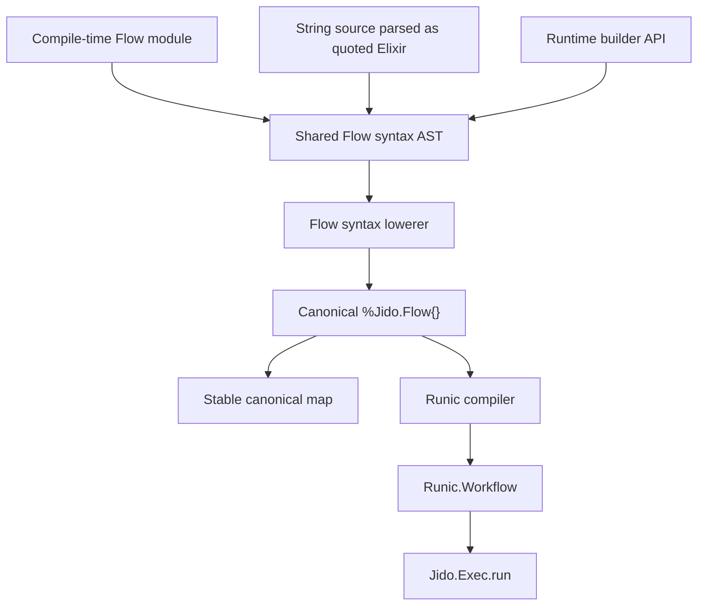
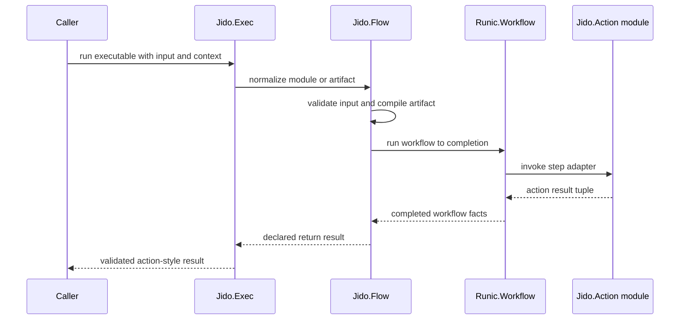
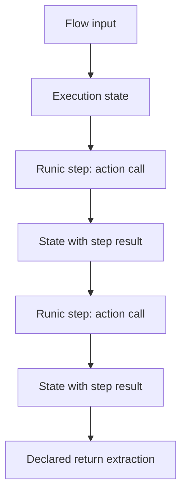
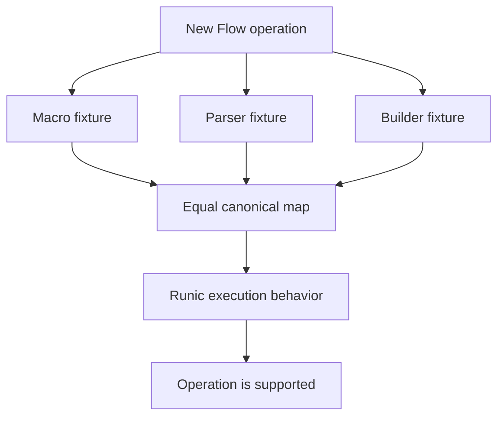

# feat: Add Flow and Exec foundation

## Summary

Implement the first v4 foundation for `Jido.Flow` and `Jido.Exec`: a canonical Flow IR, shared lowering for macro, string, and builder definitions, and Runic-backed execution through `Jido.Exec.run`. The first milestone supports only core composition operations and makes parity across authoring surfaces the acceptance gate for every feature.

---

## Problem Frame

`JIDO_V4_BRIEF.md` positions `jido_action` as the action and flow kernel, not a full workflow platform. The current branch has intentionally removed legacy Flow and Exec modules, and `test/jido_action/foundation_test.exs` asserts that only `Jido.Action` and `Jido.Instruction` are exposed today.

The new work must start from that empty composition surface. It should add v4 Flow as an artifact-first action composition model, then delegate runtime mechanics to Runic without reviving previous compatibility shims.

---

## Requirements

### Kernel Boundary

- R1. `Jido.Flow` represents a canonical runtime action-plan artifact and does not become an agent loop, scheduler policy language, persistence layer, retry DSL, or arbitrary Elixir execution environment.
- R2. `use Jido.Flow` produces a composite action module with the same public action boundary as `use Jido.Action`.
- R3. Runtime `%Jido.Flow{}` values remain data artifacts executable by `Jido.Exec`; they do not pretend to be callback modules.
- R4. `Jido.Instruction` remains a small action call frame and does not grow workflow or execution-policy semantics.

### Authoring Parity

- R5. Compile-time Flow modules, parsed string definitions, and builder/runtime definitions lower through the same syntax layer into the same canonical Flow map.
- R6. A Flow operation is unsupported unless the macro, parser, builder, and execution paths all support it or explicitly reject it with matching errors.
- R7. The first supported operation set is `input`, `value`, `result`, `step`, variable binding, and `return`.
- R8. Data-shaping sugar, static parallel authoring, and control flow are deferred until the core parity foundation is stable.

### Flow Artifact

- R9. Canonical Flow maps are stable enough for equality tests, serialization, explanation, semantic hashing, and dependency inspection.
- R10. Canonical Flow maps never contain authoring sugar such as variable names or parser-only syntax unless retained as explicit provenance metadata.
- R11. Flow construction validates duplicate step names, missing references, missing return declarations, unsupported action modules, and malformed input expressions before execution.
- R12. The current branch has no live `continue` behavior; if implementation finds hidden leftover behavior, it must route through the lowerer rather than reintroducing a compatibility shim.

### Execution

- R13. `Jido.Exec.run` accepts action modules, Flow modules, `%Jido.Flow{}` values, and `%Jido.Instruction{}` values.
- R14. Execution validates action params and outputs through the existing action callbacks and preserves the existing action result envelope semantics.
- R15. Flow execution compiles the canonical artifact into a `Runic.Workflow` and extracts the declared `return` value as the public Flow result.
- R16. Runtime context is passed through `Jido.Exec` without becoming part of the canonical Flow hash.

### Parser Safety

- R17. `Jido.Flow.parse` uses `Code.string_to_quoted` as a parser only; it never evaluates or compiles user-provided source.
- R18. The parser accepts only the Flow subset and rejects arbitrary local calls, remote calls, captures, module attributes, sigils, comprehensions, imports, requires, and unapproved aliases.
- R19. The first parser milestone treats source as trusted developer input; end-user-safe parsing with stronger atom controls is deferred but must be designed into the parser boundary.

### Testing and TDD

- R20. Implementation begins by recording the current test and coverage baseline, then proceeds test-first for each public behavior.
- R21. Every feature-bearing unit includes focused tests around the module being changed before broad suite verification.
- R22. Parity tests prove macro, string, and builder forms produce equal canonical maps for every supported operation.
- R23. Execution tests prove action module, Flow module, Flow struct, and Instruction execution all use the same validation and result rules.

---

## High-Level Technical Design

### Authoring and Lowering Pipeline



The macro DSL, parser, and builder are authoring surfaces only. They do not own semantics after lowering.

### Execution Path



Flow modules generated by `use Jido.Flow` call into this same path from their `run` boundary.

### Core Authoring Language

```text
flow artifact
  metadata: name, description, schema, output_schema
  body: operation list

operation
  step name, action, with expression
  bind variable to result reference
  return result reference

expression
  input key
  literal value
  result reference
  structured map of expressions
```

This is a directional grammar for the first milestone. It is not a new custom language; it names the subset of Elixir AST the parser and macro lowerer agree to accept.

### Phase-1 Runic Compilation Shape



The first compiler can thread an execution-state map through dependency-ordered Runic steps. The canonical IR still records step dependencies, which keeps the later transition to static parallelism honest.

### Parity Gate



No operation enters the public surface through only one authoring path.

---

## Output Structure

```text
lib/
  jido_exec.ex
  jido_flow.ex
  jido_flow/
    builder.ex
    compiler.ex
    dsl.ex
    node.ex
    parser.ex
    ref.ex
    syntax.ex
    syntax/lowerer.ex
test/
  jido_action/
    exec_test.exs
    flow_builder_test.exs
    flow_compile_test.exs
    flow_dsl_test.exs
    flow_parser_test.exs
    flow_test.exs
    flow_parity_test.exs
  support/
    flow_fixtures.ex
    test_actions.ex
```

The tree is the expected shape. Implementation may combine small modules if the tests show a simpler boundary, but the public surfaces should remain distinct.

---

## Scope Boundaries

### In Scope for This Plan

- Core Flow IR structs and canonical map behavior.
- Shared syntax AST and lowerer for `input`, `value`, `result`, `step`, binding, and `return`.
- Compile-time `use Jido.Flow` modules with action-compatible metadata, validation, artifact, compile, and run boundaries.
- Runtime builder functions that produce the same syntax AST as macro and parser forms.
- Parser support for the same subset using quoted Elixir syntax and an AST allowlist.
- Runic compilation and `Jido.Exec.run` support for action modules, Flow modules, Flow structs, and Instructions.
- Focused parity and execution tests that become the foundation for future Flow features.

### Deferred to Follow-Up Work

- `select`, `shape`, `collect`, `merge`, and other data-shaping sugar.
- `parallel` authoring sugar and true multi-parent Runic join compilation.
- `choose`, `each`, `loop`, retry policies, timeout policies, scheduler policies, and durable execution.
- End-user-safe flow source parsing with lookup-table atom controls or non-atom identifiers.
- Provenance-rich visualization beyond canonical maps and dependency introspection.
- Public documentation, changelog, Hex release work, and package metadata cleanup.

### Outside This Product's Identity

- Replacing ordinary Elixir functions, pipes, or `with` chains when the composition is not an artifact.
- Agent loops, memory, model choice, human approval workflows, platform debugging, and deployment features.
- Arbitrary Elixir evaluation inside Flow source.
- A full custom grammar unrelated to Elixir syntax.

---

## Key Technical Decisions

- KTD1. Canonical IR first: `Jido.Flow`, `Jido.Flow.Node`, and `Jido.Flow.Ref` own semantics because the brief requires stable artifacts, not nicer syntax over normal Elixir.
- KTD2. Shared syntax layer: macro, parser, and builder surfaces emit `Jido.Flow.Syntax` data so feature parity is enforced at the lowerer boundary instead of relying on duplicated AST walkers.
- KTD3. Direct Flow action generation: `use Jido.Flow` should generate the action-compatible callback surface directly and delegate `run` to `Jido.Exec`, avoiding runtime module tricks for `%Jido.Flow{}` artifacts.
- KTD4. Trusted parser milestone: `Jido.Flow.parse` starts as trusted developer input while rejecting unsafe AST forms; stronger end-user atom safety is a follow-up because the first IR remains atom-heavy.
- KTD5. Runic state-threading first: compile phase-1 nodes into dependency-ordered Runic steps that carry execution state and call Jido actions, then extract the declared return.
- KTD6. Return is a Flow concern: `return` remains part of canonical Flow semantics and should map to Runic result extraction without becoming an extra user-visible action.
- KTD7. Exec is the orchestrator boundary: `Jido.Exec` normalizes executable forms, applies validation, delegates Flow artifacts to Runic, and returns action-style results without owning workflow policy.
- KTD8. Parity tests are acceptance criteria: a new Flow operation is incomplete until macro, parser, builder, canonical map, and execution tests agree.

---

## Alternative Approaches Considered

- **Macro DSL as canonical representation:** Rejected because it makes string and builder forms second-class and conflicts with the brief's artifact-first direction.
- **Parsed string AST as canonical representation:** Rejected because parser metadata, formatting, and Elixir syntax details would leak into semantic equality.
- **Custom Runic node types immediately:** Deferred because phase-1 action calls can run as ordinary Runic steps, and custom nodes would increase the dependency surface before the Flow IR is proven.
- **Untrusted parser support in the first milestone:** Deferred because the current design remains atom-heavy and trusted developer parsing is enough to prove macro/string/builder parity.
- **Reintroducing legacy Flow compatibility:** Rejected because this branch intentionally starts from `Jido.Action` and `Jido.Instruction`; compatibility shims would bypass the v4 lowerer.

---

## Implementation Units

### U1. Establish Flow IR and Baseline

**Goal:** Add the canonical Flow data structures and update the foundation expectation from "no Flow" to "v4 Flow and Exec foundation exists."

**Requirements:** R1, R3, R9, R10, R11, R20, R21.

**Dependencies:** None.

**Files:**

- `lib/jido_flow.ex`
- `lib/jido_flow/node.ex`
- `lib/jido_flow/ref.ex`
- `test/jido_action/flow_test.exs`
- `test/jido_action/foundation_test.exs`
- `test/support/test_actions.ex`

**Approach:** Define canonical structs for Flow metadata, nodes, refs, dependency edges, return refs, and optional provenance. Keep construction explicit and validation-heavy. Add canonical map output early so every later unit can assert against the same artifact.

**Execution note:** Establish the current test and coverage baseline before changing behavior, then write failing IR tests before implementing constructors.

**Patterns to follow:** `Jido.Instruction` struct validation style, `Jido.Action` metadata conventions, and existing ExUnit module organization under `test/jido_action/`.

**Test scenarios:**

- Creates a minimal valid Flow with name, schemas, one node, and return ref, then emits a deterministic canonical map.
- Rejects duplicate node names with a validation error that identifies the duplicated name.
- Rejects a return ref that does not point to a known node.
- Rejects a node whose action module does not expose the action contract.
- Preserves extra metadata only under explicit provenance fields and keeps it out of the canonical semantic map unless intended.
- Updates the foundation test so `Jido.Flow` and `Jido.Exec` are expected v4 modules while legacy Flow modules remain absent.

**Verification:** The IR can be inspected independently of any DSL, and later units can use `Jido.Flow.to_map` as their parity oracle.

### U2. Add Shared Syntax AST, Lowerer, and Builder

**Goal:** Create the common syntax representation and lowerer used by all authoring surfaces, plus a runtime builder API for programmatic Flow construction.

**Requirements:** R5, R6, R7, R9, R10, R11, R12, R20, R21, R22.

**Dependencies:** U1.

**Files:**

- `lib/jido_flow.ex`
- `lib/jido_flow/builder.ex`
- `lib/jido_flow/syntax.ex`
- `lib/jido_flow/syntax/lowerer.ex`
- `test/jido_action/flow_builder_test.exs`
- `test/jido_action/flow_test.exs`
- `test/support/flow_fixtures.ex`

**Approach:** Model supported operations as normalized syntax data before lowering. The builder should produce syntax operations, not canonical nodes directly, so it cannot bypass validation or drift from parser and macro behavior.

**Execution note:** Implement the lowerer test-first because it is the semantic choke point for the whole feature.

**Patterns to follow:** `Jido.Instruction.new/1` normalization, `Jido.Action.validate_name/1`, and test support fixture reuse from `test/support/test_actions.ex`.

**Test scenarios:**

- Lowers input refs, literal values, result refs, step operations, variable bindings, and return declarations to the expected canonical map.
- Rejects unsupported syntax operations with an error that includes the operation kind.
- Rejects result references before they are bound.
- Accepts structured maps whose leaves are supported refs or literals.
- Confirms builder-created syntax and direct lowerer syntax emit equal canonical maps for the math milestone flow.
- Confirms no builder-only shortcut appears in the canonical map.

**Verification:** The builder can express the first milestone flow and the lowerer output is stable enough to use as the macro/parser comparison target.

### U3. Implement Compile-Time Flow DSL

**Goal:** Add `use Jido.Flow` so Flow modules expose the action-compatible boundary and the flow artifact functions described in the brief.

**Requirements:** R2, R5, R6, R7, R13, R14, R20, R21, R22.

**Dependencies:** U1, U2.

**Files:**

- `lib/jido_flow.ex`
- `lib/jido_flow/dsl.ex`
- `test/jido_action/flow_dsl_test.exs`
- `test/jido_action/flow_parity_test.exs`
- `test/support/flow_fixtures.ex`
- `test/support/test_actions.ex`

**Approach:** Collect the `flow do` block at compile time, convert the supported AST subset to syntax operations, lower it through the shared lowerer, and generate the action-compatible functions. Reuse the `Jido.Action` configuration schema where practical, but treat generated `run` delegation as the explicit composite-action exception to leaf action implementation warnings.

**Execution note:** Start with a failing macro module test built through `Module.create/3`, matching the existing action macro tests.

**Patterns to follow:** Runtime module creation tests in `test/jido_action/action_test.exs`, schema preservation in `Jido.Action.__using__/1`, and action contract validation in `Jido.Instruction`.

**Test scenarios:**

- A compile-time math Flow exposes `name`, `description`, `schema`, `output_schema`, `validate_params`, and `validate_output`.
- `flow`, `to_map`, and `compile` exist on the generated module and return the same artifact as the builder fixture.
- Variable binding maps friendly names to result refs without leaking syntax-only bindings into the semantic map.
- Missing `return` fails at compile time with a clear Flow configuration error.
- Unsupported expressions inside `flow do` fail at compile time and identify the unsupported form.
- Generated `run` delegates through `Jido.Exec` and returns the same result as executing the Flow artifact.

**Verification:** Compile-time Flow modules behave like composite actions and remain parity-compatible with runtime-built Flow artifacts.

### U4. Implement String Parser

**Goal:** Add parser support for the same first-milestone language using `Code.string_to_quoted` without evaluating source.

**Requirements:** R5, R6, R7, R17, R18, R19, R20, R21, R22.

**Dependencies:** U1, U2.

**Files:**

- `lib/jido_flow.ex`
- `lib/jido_flow/parser.ex`
- `test/jido_action/flow_parser_test.exs`
- `test/jido_action/flow_parity_test.exs`
- `test/support/flow_fixtures.ex`

**Approach:** Parse source to quoted Elixir, walk only the allowed Flow forms, and lower to the same syntax AST as the macro DSL. Keep `parse` trusted-developer scoped for this milestone while making unsupported and unsafe forms fail closed.

**Execution note:** Write parser rejection tests before happy-path parser tests so the allowlist is concrete before broadening accepted syntax.

**Patterns to follow:** The strict contract checks in `Jido.Instruction.validate_action_contract/1` and Elixir's documented `Code.string_to_quoted` options for parse metadata and atom handling.

**Test scenarios:**

- Parses the math milestone string and emits the same canonical map as the builder and macro fixtures.
- Rejects arbitrary local function calls not in the Flow subset.
- Rejects remote calls except action module aliases in the action position.
- Rejects captures, sigils, module attributes, comprehensions, imports, requires, and nested `defmodule`.
- Rejects unknown variable references and reports the unresolved binding.
- Confirms a source containing executable code is parsed as data and never executed.
- Confirms parser errors include source line metadata when available.

**Verification:** The string form can author only the supported Flow subset and participates in the same parity tests as the compile-time and builder surfaces.

### U5. Compile Flow Artifacts to Runic

**Goal:** Compile canonical Flow artifacts into `Runic.Workflow` values that execute phase-1 composition steps and support declared return extraction.

**Requirements:** R8, R13, R15, R16, R20, R21, R23.

**Dependencies:** U1, U2.

**Files:**

- `lib/jido_flow.ex`
- `lib/jido_flow/compiler.ex`
- `test/jido_action/flow_compile_test.exs`
- `test/support/flow_fixtures.ex`
- `test/support/test_actions.ex`

**Approach:** Emit named Runic steps from canonical nodes. Each step resolves its `with` expression against the execution state, validates action params, invokes the action, normalizes the result tuple, validates output, and stores the result under the node name. The first milestone can use dependency-ordered state threading while preserving canonical dependency metadata for future static parallelism.

**Execution note:** Start with a compile-only test that inspects Runic workflow structure before adding execution behavior.

**Patterns to follow:** Runic's `Workflow.add/3`, `Workflow.react_until_satisfied/3`, `Workflow.results/3`, and component naming conventions from `deps/runic/lib/workflow.ex`.

**Test scenarios:**

- Compiles a one-step Flow to a `Runic.Workflow` with a named component for the action call.
- Compiles the two-step math Flow with the expected dependency order and return binding.
- Rejects a Flow whose dependency graph cannot be topologically ordered.
- Executes the compiled workflow and extracts the value declared by `return`.
- Preserves runtime context outside the canonical map and passes it to action invocations.
- Converts action validation failures into existing `Jido.Action.Error` forms instead of raw Runic failures.
- Proves unsupported parallel branches are rejected or serialized deliberately rather than silently claiming parallel semantics.

**Verification:** `Jido.Flow.compile` returns a Runic workflow suitable for `Jido.Exec`, and compile-time failures happen before action execution.

### U6. Add Jido.Exec Orchestration

**Goal:** Implement `Jido.Exec.run` as the public execution boundary for actions, instructions, Flow modules, and Flow artifacts.

**Requirements:** R3, R4, R13, R14, R15, R16, R20, R21, R23.

**Dependencies:** U1, U3, U5.

**Files:**

- `lib/jido_exec.ex`
- `lib/jido_flow.ex`
- `lib/jido_instruction.ex`
- `test/jido_action/exec_test.exs`
- `test/jido_action/instruction_test.exs`
- `test/support/flow_fixtures.ex`
- `test/support/test_actions.ex`

**Approach:** Normalize executable inputs by shape. Action modules and Instructions use the existing action contract. Flow modules expose `flow` and delegate to the Flow artifact path. Flow artifacts validate input, compile to Runic, execute to completion, extract `return`, and validate output through the Flow's output schema.

**Execution note:** Add action and instruction execution tests first so `Exec` proves it preserves existing leaf-action behavior before Flow behavior is layered on.

**Patterns to follow:** `Jido.Instruction.normalize!/3`, action validation helpers in `Jido.Action`, and `Jido.Action.Error.to_map/1` normalization.

**Test scenarios:**

- Executes a leaf action module with input and context, validating params before run and output after run.
- Executes a `%Jido.Instruction{}` and merges call-site input or context according to the existing instruction normalization rules.
- Executes a Flow module and a Flow artifact with the same input and returns the same value.
- Returns action errors without wrapping them in unrelated Runic-specific errors.
- Converts raised action exceptions during Flow execution into existing execution error forms.
- Validates Flow output schema and returns validation errors when the declared return does not match.
- Rejects unknown executable values with a clear configuration error.

**Verification:** Users can call one execution boundary for the four supported executable shapes without losing action validation semantics.

### U7. Build the Parity Harness

**Goal:** Make parity the durable contract for all current and future Flow operations.

**Requirements:** R5, R6, R7, R20, R21, R22, R23.

**Dependencies:** U2, U3, U4, U5, U6.

**Files:**

- `test/jido_action/flow_parity_test.exs`
- `test/support/flow_fixtures.ex`
- `test/support/test_actions.ex`

**Approach:** Define shared fixtures for the first milestone math flow across builder, macro, and string forms. Use those fixtures to assert equal canonical maps, equivalent compilation shape, and equivalent execution outputs.

**Execution note:** Treat this as the acceptance gate before marking any Flow operation done.

**Patterns to follow:** Existing property tests in `test/jido_action/action_test.exs` and the test support helper structure under `test/support/`.

**Test scenarios:**

- Builder, macro, and parser math flows produce exactly equal semantic canonical maps.
- Canonical maps remain equal after formatting differences in string source.
- Unsupported operation fixtures fail across macro, parser, and builder paths with equivalent error categories.
- Property test generates simple chains of supported operations and proves builder and syntax-lowered maps agree.
- Executing equivalent builder, macro, and parser flows with the same input returns the same result.
- Canonical maps do not contain syntax-only variable binding names unless provenance metadata is explicitly requested.

**Verification:** Future Flow features have a test harness that catches authoring-surface drift before execution behavior can merge.

### U8. Harden Boundaries and Failure Reporting

**Goal:** Tighten error reporting, source provenance, and edge-case behavior after the happy path is working.

**Requirements:** R11, R14, R17, R18, R19, R20, R21, R23.

**Dependencies:** U3, U4, U5, U6, U7.

**Files:**

- `lib/jido_flow.ex`
- `lib/jido_flow/parser.ex`
- `lib/jido_flow/syntax/lowerer.ex`
- `lib/jido_flow/compiler.ex`
- `lib/jido_exec.ex`
- `test/jido_action/flow_parser_test.exs`
- `test/jido_action/flow_compile_test.exs`
- `test/jido_action/exec_test.exs`

**Approach:** Standardize error shapes and metadata after the main surfaces exist. Parser and macro errors should point at unsupported source forms where possible. Runtime errors should preserve action-layer error categories so downstream Jido packages do not need Runic-specific pattern matching.

**Execution note:** Add characterization tests for any error shape already introduced in earlier units before refactoring messages or metadata.

**Patterns to follow:** `Jido.Action.Error` constructors, `Jido.Action.Error.to_map/1`, and source-aware compile errors in `Jido.Action.__using__/1`.

**Test scenarios:**

- Duplicate step, missing return, unresolved result, and unsupported AST errors each include the operation or source location needed to fix the Flow.
- Parser rejection tests confirm no unsafe form is accepted because it happens to lower to a benign value.
- Action exceptions inside compiled Runic steps surface as execution errors with action and step metadata.
- Validation errors identify whether failure happened at Flow input, step input, step output, or Flow output.
- Compile errors remain deterministic across macro and parser authoring paths.
- Provenance metadata can be inspected without changing the semantic canonical map.

**Verification:** The foundation is usable for follow-up features because failures point to Flow concepts, not internal Runic mechanics.

---

## Acceptance Examples

- AE1. Given a compile-time math Flow module, when the caller asks for `to_map`, the result equals the canonical map produced by the builder fixture.
- AE2. Given the equivalent math Flow source string, when `Jido.Flow.parse` lowers it, the result equals the macro and builder canonical maps.
- AE3. Given the math Flow artifact and input value `3`, when `Jido.Exec.run` executes it, the returned value is the declared doubled result.
- AE4. Given an unsupported parser form such as an arbitrary function call, when parsing runs, the parser rejects it without executing source.
- AE5. Given an action that fails output validation inside a Flow, when `Jido.Exec.run` executes the Flow, the error uses the existing action validation error shape.
- AE6. Given a future Flow operation proposal, when it is implemented in only one authoring surface, parity tests fail until all supported surfaces agree.

---

## System-Wide Impact

This plan adds new exported public modules and changes the foundation expectation from "no Flow or Exec" to "v4 Flow and Exec exist." It also introduces `Runic.Workflow` as an active execution dependency rather than an unused package dependency.

The main affected readers are downstream Jido packages and future composition work. Keeping `Jido.Instruction` small and `Jido.Exec` narrow prevents this package from absorbing higher-level agent runtime concerns.

Failure propagation becomes a public contract. Parser errors, lowerer errors, action validation failures, action exceptions, Runic failures, and return extraction failures should surface as Flow or action-layer concepts, not as unexplained internal graph state.

The parity harness becomes a cross-interface gate for all future Flow work. That raises test cost per operation, but it prevents the macro DSL from becoming the only well-tested surface.

---

## Risks & Dependencies

- **Runic alpha API churn:** The project depends on `runic` `0.1.0-alpha.8`; compiler code should stay small and isolated in `Jido.Flow.Compiler` so Runic API changes do not leak through the public Flow surface.
- **Parser atom safety:** The first milestone is trusted developer input. End-user supplied text remains unsafe until the parser can avoid uncontrolled atom creation or use strict lookup-based atom handling.
- **Macro/parser drift:** The shared syntax layer and parity harness are the main mitigation. Any direct canonical construction from a DSL path should be rejected in review.
- **Result envelope ambiguity:** Actions may return maps, `Jido.Action.Output`, or tuples with extras. `Jido.Exec` must characterize existing action behavior before adapting it to Flow steps.
- **Parallelism temptation:** Runic can execute independent nodes concurrently, but this milestone should not claim static parallel semantics until `parallel` and multi-parent joins are designed.
- **Error wrapping:** Runic failures should not force consumers to learn Runic internals for normal action validation or execution failures.
- **Generated module contract drift:** Flow modules must stay compatible with the current action contract. Macro tests should fail if `Jido.Action` adds required callbacks that Flow modules do not expose.
- **State-threading ceiling:** The phase-1 compiler shape is intentionally conservative. Future parallel work must revisit compiler internals rather than treating state-threading as permanent architecture.

---

## Deferred Implementation Notes

- Exact semantic hash fields should be settled while implementing U1, after seeing which map fields must remain stable across provenance changes.
- Exact provenance metadata shape can be minimal in the first milestone, as long as it does not pollute semantic equality.
- The first compiler can use state threading for deterministic phase-1 composition; true dataflow fan-out and join semantics belong with the later `parallel` milestone.
- If a small strict-parser option falls out naturally from the AST walker, it can be added behind tests, but it should not expand this milestone into full untrusted configuration support.

---

## Sources & Research

- `JIDO_V4_BRIEF.md` is the design source for the v4 Flow and Exec boundary.
- `AGENTS.md` sets the TDD posture, dependency policy, and design direction for this branch.
- `lib/jido_action.ex`, `lib/jido_instruction.ex`, `lib/jido_action/output.ex`, and `lib/jido_action/error.ex` define the action, instruction, output, and error contracts the new foundation must preserve.
- `test/jido_action/foundation_test.exs`, `test/jido_action/action_test.exs`, `test/jido_action/instruction_test.exs`, and `test/jido_action/action_output_test.exs` show the current test style and expected public surface.
- `deps/runic/README.md`, `deps/runic/lib/runic.ex`, and `deps/runic/lib/workflow.ex` show the local Runic workflow, composition, result extraction, and execution APIs.
- [Runic.Workflow v0.1.0-alpha.8 HexDocs](https://hexdocs.pm/runic/Runic.Workflow.html) confirms the three-phase Runic execution model, run-to-completion API, runtime context behavior, and workflow composition APIs.
- [Elixir `Code.string_to_quoted/2` HexDocs](https://hexdocs.pm/elixir/Code.html#string_to_quoted/2) documents quoted parsing and the `existing_atoms_only` option relevant to parser safety.
- [EEF Security WG atom exhaustion guidance](https://security.erlef.org/secure_coding_and_deployment_hardening/atom_exhaustion.html) frames why end-user-safe parsing needs stricter atom controls than the trusted developer milestone.
