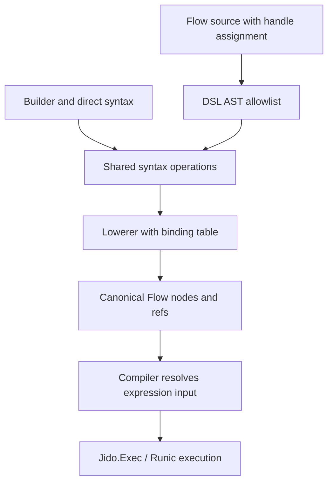
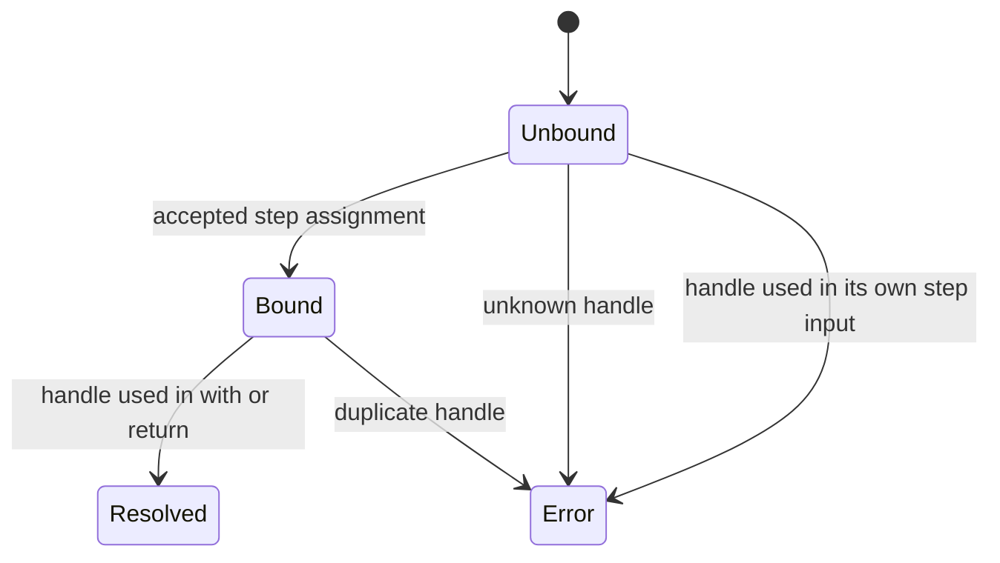

# feat: Add Binding-First Flow script spine

## Summary

Add the first ergonomic Flow syntax slice: bound step handles, `with:` input wiring, and `return` by handle across macro, parser, builder, and direct syntax surfaces. The broader `with: handle` form is in scope, so canonical node input must broaden from map-only input to Flow expression input while keeping bindings out of semantic maps.

---

## Problem Frame

The current Flow foundation already has the right architecture for careful syntax growth: macro DSL, string parser, builder, and direct syntax all lower through `Jido.Flow.Syntax.Lowerer` into canonical `%Jido.Flow{}` data.

The next feature should make Flow read like a small script without turning Flow source into arbitrary Elixir. The brief and ideation both point at bound handles as the spine for later `select`, `shape`, collection, and loop work, but this slice must remain a small composition feature.

---

## Requirements

### Authoring Syntax

- R1. Flow source supports `handle = step :name, Action, with: expression` where `handle` is a symbolic alias for the step result.
- R2. Flow source supports `return handle` when `handle` is a previously bound step result.
- R3. Flow source supports `with: handle` as the whole step input and `with: %{field: handle}` inside structured inputs.
- R4. Existing positional step input syntax remains supported for compatibility with current tests and fixtures.
- R5. `with:` is the only accepted macro/parser step option for this slice; `bind:`, unknown options, and missing input remain rejected.

### Canonical Semantics

- R6. A binding handle lowers to `Ref.result(step_name)` and never becomes a semantic field in `Flow.to_map/1`.
- R7. Canonical `Node.input` accepts Flow expression input, not only maps, so root result refs are valid step inputs.
- R8. `with: handle` passes the exact stored result value for that step; action schemas decide whether that value is valid params.
- R9. Binding aliases are retained only as node provenance and appear only when `Flow.to_map/2` is called with `provenance: true`.

### Safety and Parity

- R10. Macro, parser, builder, and direct syntax surfaces produce equal canonical maps for the binding-first fixture.
- R11. Parser support stays allowlisted AST parsing and does not evaluate variables, local calls, remote calls, operators, pins, module attributes, captures, or pattern matches.
- R12. Binding lookup rejects unknown handles, duplicate aliases, self-references, and references before binding.
- R13. Path projection through handle syntax such as `added.value` is out of scope; authors use existing `result(:step, :path)` until `select` lands.
- R17. Binding handles use a single source namespace with step names and reserve Flow helper names such as `flow`, `step`, `return`, `input`, `value`, and `result`.

### Execution and TDD

- R14. Flow execution resolves root result-ref inputs and derives dependencies from them.
- R15. Implementation begins with the current test and coverage baseline, then proceeds test-first for every touched module.
- R16. The feature is complete only when focused module tests and the integration parity suite cover the new syntax and runtime behavior.
- R18. Whole-result wiring preserves `Jido.Action.Output` envelopes as exact stored results and does not unwrap them implicitly.

---

## High-Level Technical Design

### Binding Lowering Pipeline



### Binding State Transitions



### Directional Grammar

```text
statement
  step name, action, input
  handle = step name, action, with: expression
  step name, action, with: expression
  return result_ref
  return handle

expression
  input(path)
  value(literal)
  result(step, path?)
  handle
  map of expressions
  list of expressions
  literal
```

`handle` is a source-level binding lookup, not an Elixir variable and not a runtime value.

---

## Scope Boundaries

### In Scope for This Plan

- Binding handles for step results.
- `with:` step input wiring in macro and parser source.
- Programmatic parity through `Jido.Flow.Syntax` and `Jido.Flow.Builder`.
- Root expression support for canonical node input.
- Return-by-handle support.
- Runtime tests for whole-result wiring.

### Deferred to Follow-Up Work

- `select`, `shape`, dot-path syntax, arithmetic, predicates, transforms, and general expression evaluation.
- `after:` or `depends_on:` explicit graph edges.
- Branch grouping, static parallelism, joins, map, reduce, accumulate, and loops.
- ReAct agent loops, model/tool policy, durable checkpoints, memory, retries, timeouts, and human approval flows.
- End-user-safe source parsing with stricter atom controls.

### Outside This Product's Identity

- Arbitrary Elixir evaluation inside Flow source.
- A full custom grammar unrelated to quoted Elixir syntax.
- Reintroducing legacy composition/runtime compatibility shims.

---

## Key Technical Decisions

- KTD1. Bindings are symbolic aliases over step results: this preserves the canonical IR as the source of truth and keeps source names out of semantic equality.
- KTD2. `with: handle` passes the full stored result: this matches `Ref.result(:step)` with an empty path and avoids hidden unwrapping rules.
- KTD3. Node input becomes expression-shaped with an explicit semantic map contract: root refs serialize with `Ref.to_map/1`, maps and lists recurse through expression serialization, and literals serialize as value refs.
- KTD4. Handle path projection is deferred: adding `added.value` now would smuggle in data-shaping syntax before `select` and `shape` are designed.
- KTD5. Macro/parser source uses assignment for bindings: `bind:` stays rejected in source so there is one obvious authoring style.
- KTD6. Direct syntax means the public `Jido.Flow.Syntax` operation stream: binding support is expressed as a step binding attribute plus a binding expression, with builder helpers mirroring those semantics.
- KTD7. Parser safety remains fail-closed: simple variable AST nodes are emitted only as binding expressions, and the lowerer rejects unknown or invalid bindings.
- KTD8. Handles and step names share one source namespace for this slice: aliases cannot duplicate existing aliases, existing step names, reserved Flow helper names, or later step names.
- KTD9. Binding provenance is node-local: the minimal shape is the binding alias plus source line metadata when available, and it is emitted only with `provenance: true`.

---

## IR Contract

`Node.input` changes from a map-only field to an expression tree. Existing map inputs keep the same semantic map shape, so current fixtures remain valid. A root `Ref.result(:step)` input serializes as `%{type: :result, node: :step, path: []}` at `node.input`, and root lists or literals use the same recursive expression serialization already used inside maps.

This is a public v4 IR change, but it is required by the user-confirmed `with: handle` scope and the brief's first-milestone `with: added` example. A narrower root-ref-only rule was rejected because it would create different validation and serialization rules for root expressions versus nested expressions while the lowerer and compiler already operate on expression trees.

---

## Implementation Units

### U1. Broaden Canonical Node Input

**Goal:** Change canonical node input from map-only to Flow expression input so root result refs can represent `with: handle`.

**Requirements:** R3, R7, R8, R14, R15, R16.

**Dependencies:** None.

**Files:**

- `lib/jido_flow/node.ex`
- `test/jido_flow/node_test.exs`

**Approach:** Reuse the existing nested input expression validator at the root. Preserve `nil` as empty map input for compatibility, keep dependency derivation recursive, update the Zoi schema and public specs away from map-only input, and make `Node.to_map/2` serialize root refs, lists, literals, and maps consistently through the existing expression map logic.

**Execution note:** Add characterization tests for the current map-only rejection before changing validation.

**Patterns to follow:** Existing `Node.validate_input_expression/2`, `Node.result_deps/1`, and `Ref.to_map/1`.

**Test scenarios:**

- Builds a node whose root input is `Ref.result(:add_one)` and derives `[:add_one]` as dependencies.
- Builds a node whose root input is `Ref.input(:payload)` and serializes it as an input ref in `Node.to_map/1`.
- Builds a node whose root input is a list or literal and serializes it through the same expression map rules as nested values.
- Preserves existing map input behavior and nested dependency extraction.
- Preserves `nil` input as `%{}`.
- Updates the `Node`, `Syntax.step`, and `Builder.step` specs or docs that currently describe input as map-only.
- Rejects a malformed root result ref with error details at the root path.
- Rejects an unsupported root struct with the same error category used for unsupported nested expressions.

**Verification:** Canonical Flow nodes can represent whole-result step input without parser or builder special cases.

### U2. Add Binding Expressions to Shared Syntax and Lowerer

**Goal:** Teach the shared syntax layer to represent source handles and resolve them through a binding table during lowering.

**Requirements:** R2, R3, R6, R8, R9, R12, R13, R15, R16, R17.

**Dependencies:** U1.

**Files:**

- `lib/jido_flow/syntax.ex`
- `lib/jido_flow/syntax/lowerer.ex`
- `test/jido_flow/syntax_test.exs`
- `test/jido_flow/syntax/lowerer_test.exs`
- `test/support/flow_fixtures.ex`

**Approach:** Add a binding expression type that resolves to a result ref during lowering. Extend step operations with binding metadata, update lowerer state with a binding table, pre-scan the operation stream for source namespace collisions, and record binding aliases only in node provenance. A step assignment binds after its input expression resolves, which prevents self-reference.

**Execution note:** Drive this unit with failing lowerer tests before exposing the syntax through DSL or builder APIs.

**Patterns to follow:** Current lowerer state for `seen` node names, result-before-bound errors, and provenance omission in `Flow.to_map/1`.

**Test scenarios:**

- Lowers a bound step and `return handle` to the same canonical return as `return result(:step)`.
- Lowers `with: handle` to root `Ref.result(:step)` input.
- Lowers `with: %{quote: handle}` to nested result refs.
- Rejects an unknown binding with details that include the binding name and consuming step when available.
- Rejects a duplicate binding alias.
- Rejects a binding used in the same step input before it is bound.
- Rejects binding aliases that collide with existing step names, reserved helper names, or later step names.
- Confirms `Flow.to_map/1` omits binding aliases while `Flow.to_map(provenance: true)` exposes them in node provenance.
- Confirms node provenance can include both the binding alias and source line metadata when source metadata exists.
- Keeps explicit `result(:step, :path)` behavior unchanged for path access.

**Verification:** Direct syntax can express the binding-first flow and lower to stable canonical maps with no authoring sugar in semantic output.

### U3. Extend Macro DSL and Parser Allowlist

**Goal:** Expose binding assignment, `with:` input, and return-by-handle in source forms while keeping parser safety fail-closed.

**Requirements:** R1, R2, R3, R4, R5, R10, R11, R12, R13, R15, R16.

**Dependencies:** U2.

**Files:**

- `lib/jido_flow/dsl.ex`
- `lib/jido_flow/parser.ex`
- `test/jido_flow/dsl_test.exs`
- `test/jido_flow/parser_test.exs`
- `test/support/flow_fixtures.ex`

**Approach:** Parse assignment only when the left side is a simple handle and the right side is a supported `step`. Parse `step` keyword input only when it contains exactly `with:`. Parse simple variable AST nodes as binding expressions without resolving them; the lowerer owns known-binding, before-binding, duplicate, and self-reference validation.

**Execution note:** Replace the current binding rejection tests with positive binding tests plus stricter invalid binding and unsafe AST tests.

**Patterns to follow:** Existing `parse_statement/2`, `parse_expression/2`, compile-error wrapping in `Parser.parse/2`, and parser rejection tests for unsafe forms.

**Test scenarios:**

- Macro DSL accepts `added = step :add_one, Add, with: %{value: input(:value)}` and `return added`.
- Macro DSL accepts `step :double, Multiply, with: added`.
- Parser accepts the equivalent source string and returns the same canonical map.
- Existing positional input syntax still works in macro and parser paths.
- Source rejects `step :add_one, Add, bind: :added` and unknown options.
- Source rejects assignments whose right side is not a supported step.
- Source rejects pattern assignments, pinned variables, tuple/list patterns, nested assignments, local calls, remote calls, operators, module attributes, captures, sigils, and comprehensions.
- Source rejects unbound handles through lowerer validation after parsing emits binding expressions.
- Parser errors preserve source line metadata for unsupported assignment and binding forms.

**Verification:** Source authoring supports the script spine without admitting arbitrary Elixir variables or evaluation.

### U4. Add Builder and Fixture Parity

**Goal:** Provide programmatic support for the same binding semantics and make parity tests the acceptance gate.

**Requirements:** R6, R8, R9, R10, R12, R15, R16.

**Dependencies:** U2, U3.

**Files:**

- `lib/jido_flow/builder.ex`
- `test/jido_flow/builder_test.exs`
- `test/integration/flow_parity_test.exs`
- `test/support/flow_fixtures.ex`

**Approach:** Extend builder/direct syntax so tests can create the same binding-first operation stream without using parser or macro source. Keep existing builder calls working. Add a new binding-first fixture rather than replacing the existing math fixture so explicit `result/2` flows remain covered.

Directional API shape: direct syntax should be able to express a bound step operation, a binding expression, and return-by-binding. Builder should mirror that shape with equivalent helpers or options; exact names can move during implementation, but the minimum semantics are fixed.

Directional sketch, not exact API:

```elixir
Syntax.step(syntax, :add_one, Add, input, bind: :added)
Syntax.binding(:added)
Builder.step(builder, :add_one, Add, input, bind: :added)
Builder.binding(:added)
```

**Execution note:** Build the binding-first fixture in tests first, then make each authoring surface match it.

**Patterns to follow:** Existing `FlowFixtures.math_*` helpers and `test/integration/flow_parity_test.exs` equality tests.

**Test scenarios:**

- Builder-created binding syntax and direct syntax lower to equal canonical maps.
- Builder/direct syntax can create a bound step alias, reference that alias as root or nested input, and return by alias.
- Macro, parser, builder, and direct syntax binding-first flows produce equal semantic maps.
- Formatting differences in parser source do not change the binding-first canonical map.
- Existing math parity tests with explicit `result/2` references continue to pass.
- Unsupported binding forms fail across source surfaces with validation or compile errors in the expected categories.
- Canonical maps contain node names and refs, not source binding aliases.

**Verification:** Future Flow syntax work has a durable parity fixture for handle-based script authoring.

### U5. Verify Runtime Whole-Result Wiring

**Goal:** Prove `with: handle` executes as whole-result input and derives runtime dependencies correctly.

**Requirements:** R3, R8, R14, R15, R16, R18.

**Dependencies:** U1, U2, U3, U4.

**Files:**

- `lib/jido_flow/compiler.ex`
- `test/jido_flow/compiler_test.exs`
- `test/jido_exec/exec_test.exs`
- `test/integration/flow_parity_test.exs`
- `test/support/test_actions.ex`

**Approach:** The compiler already resolves refs at the root of an input expression, so most runtime work should be verification and any adjustment needed after `Node.input` broadens. Tests should prove the action validation boundary handles the exact value produced by the prior step.

**Execution note:** Add compiler tests before changing runtime code so existing root-ref behavior is characterized through canonical nodes.

**Patterns to follow:** Existing compiler tests for nested expression resolution, validation error tagging, and execution parity.

**Test scenarios:**

- Executes a flow where `with: handle` passes `%{value: n}` from one action into the next action.
- Confirms dependency order includes a root result-ref input.
- Confirms `return handle` returns the full prior result.
- Confirms `with: handle` passes an explicit `Jido.Action.Output` envelope unchanged to a permissive test action.
- Confirms invalid whole-result params fail through existing step input validation metadata.
- Confirms macro, parser, and builder binding-first flows execute with the same input and return the same output.

**Verification:** The new syntax is not just parseable; it runs through `Jido.Exec` with the same validation semantics as explicit canonical refs.

---

## Acceptance Examples

- AE1. Given a macro Flow with `added = step :add_one, Add, with: %{value: input(:value)}`, when `return added` lowers, the canonical return is `Ref.result(:add_one)`.
- AE2. Given a macro Flow with `doubled = step :double, Multiply, with: added`, when it executes after `added` returns `%{value: 4}`, the second action receives `%{value: 4}` as params.
- AE3. Given equivalent macro, parser, builder, and direct syntax binding-first flows, when each is converted with `Flow.to_map/1`, all semantic maps are equal.
- AE4. Given parser source with `with: System.system_time()` or `added.value`, when parsing runs, the source is rejected and no code is executed.
- AE5. Given `Flow.to_map/1` for a binding-first flow, the map contains canonical node names and refs but no binding aliases; given `Flow.to_map(provenance: true)`, binding aliases appear only in node provenance.
- AE6. Given a prior step returns `Jido.Action.Output.raw(value)`, when `with: handle` passes that result to a permissive action, the output envelope is passed unchanged.

---

## System-Wide Impact

This change promotes Flow input expressions from a nested-map-only convention to a canonical node-input contract. That is a public IR change inside the new v4 Flow surface, so tests must cover direct `Node` construction, syntax lowering, compiler execution, and all authoring surfaces.

The parser accepts a new class of AST node: simple variables. That increases safety risk unless the allowlist treats them strictly as known binding lookups.

The feature also creates the readability foundation for later data shaping and loop syntax. Keeping projection and control flow out of this slice prevents those later semantics from being hidden inside binding support.

---

## Risks & Dependencies

- **Mini-evaluator risk:** accepting variable AST can accidentally admit ordinary Elixir behavior. The mitigation is to accept only known binding handles and reject all calls, operators, patterns, and projection syntax.
- **Canonical map drift:** retaining aliases in semantic output would break parity and make formatting/source choices observable. The mitigation is provenance-only alias retention.
- **Root input ambiguity:** whole-result input may be a map, scalar, or output envelope. The mitigation is to define `with: handle` as exact result passing and let action validation decide.
- **Builder API ambiguity:** keyword-style builder input can conflict with list-shaped inputs. The mitigation is to keep existing builder calls and make any new builder binding API explicit in tests.
- **Surface drift:** macro/parser support may land before builder/direct syntax. The mitigation is to make integration parity tests part of the feature-bearing work, not a follow-up.
- **Path temptation:** `added.value` would be ergonomic but belongs to projection design. The mitigation is an explicit rejection test and a deferred `select` milestone.

---

## Deferred Implementation Notes

- Exact helper names can be adjusted during U4, but the required builder/direct syntax semantics are fixed by KTD6 and U4.
- Provenance shape can stay minimal: binding alias plus source line metadata where available.

---

## Sources & Research

- `JIDO_V4_BRIEF.md` names binding, `with:`, and return-by-binding as Phase 1 Flow composition syntax.
- `docs/ideation/2026-06-25-jido-flow-syntax-ideation.html` ranks Binding-First Script Spine as the top syntax addition and frames handles as source-level sugar over result refs.
- `docs/plans/2026-06-25-001-feat-flow-exec-foundation-plan.md` establishes canonical IR, shared lowerer, parser safety, and authoring parity as foundational constraints.
- The user confirmed the broader `with: handle` option for this plan, so the public IR broadening is intentional rather than incidental syntax sugar.
- `AGENTS.md` requires TDD, baseline awareness, focused coverage for touched modules, slim surface area, and no new production dependencies.
- `lib/jido_flow/syntax.ex`, `lib/jido_flow/syntax/lowerer.ex`, `lib/jido_flow/dsl.ex`, `lib/jido_flow/parser.ex`, and `lib/jido_flow/builder.ex` are the authoring and lowering seams this feature extends.
- `lib/jido_flow/node.ex` is the canonical input-validation seam that must broaden for root `with: handle`.
- `lib/jido_flow/compiler.ex` already resolves root refs at execution time and should need focused verification rather than broad runtime redesign.
- `test/integration/flow_parity_test.exs`, `test/support/flow_fixtures.ex`, and focused `test/jido_flow/*` suites define the parity and module-test patterns to follow.
