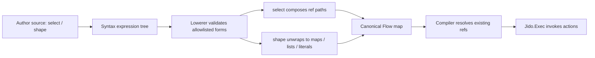

# feat: Add Projection-Only Flow data shaping

## Summary

Add a small projection-only data shaping layer to `Jido.Flow` with two authoring helpers:

- `select(source, path)` projects a path from an existing flow source.
- `shape(data)` makes structured action inputs easier to read without changing the canonical IR.

This is the next step after binding-first scripts. It gives authors a readable way to wire action inputs and returns while preserving the current v4 boundary: `Jido.Flow` models IR and action composability, and `Jido.Exec` remains the exclusive invocation normalization boundary.

The feature intentionally avoids transforms, predicates, arithmetic, captures, arbitrary function calls, collection operations, branching, and loops.

---

## Problem Frame

Binding-first syntax made flow scripts read like small programs:

```elixir
cart = step :load_cart, LoadCart, with: input(:cart_id)
quote = step :price_cart, PriceCart, with: cart
return quote
```

The next practical authoring gap is payload wiring. Real flows often need to pass a few nested values from input and prior action results into the next action. Today that is possible through canonical refs and raw maps, but the syntax still pushes authors toward lower-level IR details.

Projection-only shaping should solve the common case:

```elixir
cart = step :load_cart, LoadCart, with: input(:cart_id)
quote = step :price_cart, PriceCart, with: cart

step :audit_quote, AuditQuote,
  with: shape(%{
    cart_id: input(:cart_id),
    quote_id: select(quote, :id),
    total: select(quote, :total)
  })

return select(quote, :total)
```

The larger language direction still includes map, reduce, accumulate, and loops for agent-style flows. This slice should not anticipate those semantics. It should only establish a disciplined projection vocabulary that later features can build on.

---

## Requirements

### R1. Projection Helper

`select(source, path)` must project a path from an existing projection-capable source.

Supported source categories:

- `input(...)`
- `result(...)`
- binding handles such as `quote`
- nested `select(...)` expressions, where paths compose

Unsupported source categories:

- literal values
- shaped structures
- arbitrary local or remote function calls
- arithmetic, predicates, captures, or transformed expressions

### R2. Path Model

`select` must use the same path model as existing refs:

- atoms and strings are single path segments
- integers address list indexes
- lists represent multi-segment paths
- `nil` or an empty list represents root selection only where the existing ref model already allows it

Examples:

- `select(quote, :total)`
- `select(input(:payload), [:items, 0, :id])`
- `select(select(quote, :pricing), :total)`

### R3. Shaping Helper

`shape(data)` must be explicit readability sugar over structured expression data.

Supported shape contents:

- maps
- lists
- literals
- `input(...)`
- `result(...)`
- binding handles
- `select(...)`
- nested `shape(...)` where useful, though it should be flattened during lowering

Raw maps and lists must remain valid without `shape(...)`. The helper is an authoring affordance, not a new required container.

### R4. Expression Slots

Projection expressions must work anywhere Flow already accepts expression-shaped input:

- step `with:` values
- nested maps and lists used as action input
- builder/direct syntax values
- parser source values
- return values when the selected source resolves to a result ref

This slice should allow `return select(quote, :total)` but should not broaden `return` to arbitrary shaped structures.

### R5. Authoring Surface Parity

The following authoring surfaces must support equivalent projection-only shaping:

- direct syntax API
- builder API
- macro DSL
- text parser

Equivalent programs across these surfaces must lower to equal canonical Flow maps.

### R6. Canonical IR Stability

`select` and `shape` must lower to existing canonical structures:

- refs
- maps
- lists
- literals

They must not introduce runtime-only expression nodes that require the compiler to become a general expression evaluator.

### R7. Runtime Boundary

Runtime evaluation must continue to use the existing compiler expression resolution and path traversal behavior. The implementation must not move invocation normalization into `Jido.Flow`; action invocation normalization belongs in `Jido.Exec`.

### R8. Error Surface

Unsupported projection and shaping forms must fail early with source-oriented errors where the parser or DSL has source context.

Examples that should remain rejected:

- `quote.total`
- `select(value(%{}), :id)`
- `select(quote, System.system_time())`
- `shape(System.system_time())`
- `shape(%{x: quote.total})`

---

## Scope Boundaries

In scope:

- `select(source, path)`
- `shape(data)`
- parser and macro allowlist expansion for only these forms
- path composition during lowering
- canonical parity across authoring surfaces
- runtime verification using existing compiler path traversal

Out of scope:

- dot path syntax such as `quote.total`
- variadic projection syntax such as `select(quote, :a, :b)`
- computed paths
- transforms
- predicates
- arithmetic
- captures
- arbitrary function calls
- map, reduce, accumulate, or loop semantics
- returning shaped structures
- execution policy or graph scheduling changes
- new production dependencies
- release hygiene, changelog, package metadata, or Hex tasks

---

## Key Technical Decisions

### KTD1. `select` lowers by path composition

`select` should not survive as a runtime operation in the canonical Flow map. The lowerer should resolve its source to an existing ref-like expression, compose the selected path onto that source, and emit the same kind of canonical ref the compiler already understands.

That means:

- `select(input(:payload), [:items, 0, :id])` lowers to an input ref with the composed path.
- `select(quote, :total)` lowers through the binding table to a result ref for the bound step plus the selected path.
- nested `select` expressions collapse into one composed path.

This keeps compiler changes small and avoids introducing a general evaluator.

### KTD2. `shape` is readability-only sugar

`shape` should normalize away during lowering. It should preserve the same canonical representation as an equivalent raw map or list expression.

This avoids making authors choose between "real" maps and DSL-specific maps. `shape` exists to make scripts read clearly, especially once flows start mixing bindings and projections.

### KTD3. Parser changes stay allowlist-based

The parser and macro DSL should add explicit handling for only `select` and `shape`. Other local calls, remote calls, dot access, arithmetic, captures, and predicates remain rejected.

The point is to make the language feel deliberate, not to expose Elixir expression evaluation.

### KTD4. Return remains result-ref oriented

`return select(quote, :total)` is allowed because it resolves to a result ref. `return shape(...)` is out of scope because it would require broadening the Flow return contract to arbitrary shaped values.

That larger return-shaping question should be handled separately after projection-only inputs prove useful.

### KTD5. No invocation normalization changes

This feature must not change the `Jido.Flow` and `Jido.Exec` boundary. `Jido.Flow` can produce canonical action input expressions, but `Jido.Exec` remains responsible for exclusive invocation normalization.

---

## High-Level Technical Design



The author-facing grammar expands by two explicit forms:

- `select(source, path)`
- `shape(data)`

The lowerer is the main semantic boundary. It should decide whether a `select` source is projection-capable, normalize paths, compose nested selections, and unwrap `shape` before canonical emission.

The compiler should need little or no new behavior because the lowered program should still be composed from refs, maps, lists, and literals.

---

## Implementation Units

### U1. Add direct syntax and builder affordances

Files:

- `lib/jido_flow/syntax.ex`
- `lib/jido_flow/builder.ex`
- `test/jido_flow/syntax_test.exs`
- `test/jido_flow/builder_test.exs`

Work:

- Add direct syntax support for projection and shaping expressions.
- Add builder helpers that mirror the direct syntax surface.
- Keep the helper shapes minimal and lowerer-owned; the syntax layer should construct intentional expressions rather than normalize semantics itself.

Test scenarios:

- Constructing `select(input(:payload), [:items, 0, :id])` produces a valid syntax expression.
- Constructing `select(binding(:quote), :total)` produces a valid syntax expression.
- Constructing `shape(%{total: select(binding(:quote), :total)})` preserves the nested expression tree for the lowerer.
- Builder helpers produce the same expression structures as direct syntax helpers.
- The syntax layer does not accept or normalize arbitrary function-like shapes.

### U2. Lower projection and shape expressions

Files:

- `lib/jido_flow/syntax/lowerer.ex`
- `test/jido_flow/syntax/lowerer_test.exs`
- `test/jido_flow/flow_test.exs`

Work:

- Resolve `select` sources through the existing input, result, and binding lowering paths.
- Compose selected paths onto the resolved ref.
- Flatten nested `select` expressions into a single canonical ref path.
- Lower `shape` by recursively lowering its contents into existing canonical maps, lists, refs, and literals.
- Preserve binding validation, self-reference detection, and dependency derivation.

Test scenarios:

- `select(input(:payload), [:items, 0, :id])` lowers to an input ref with the composed path.
- `select(binding(:quote), :total)` lowers to the bound step result ref plus `:total`.
- `select(select(binding(:quote), :pricing), :total)` lowers to the same ref as a single composed path.
- `shape(%{quote_id: select(binding(:quote), :id), tags: [input(:tag)]})` lowers to a canonical map and list structure.
- Raw map/list input and equivalent `shape(...)` input lower to the same canonical map.
- `return select(binding(:quote), :total)` is accepted when the binding resolves to a result ref.
- `return shape(%{total: select(binding(:quote), :total)})` remains rejected.
- `select(value(%{}), :id)` is rejected because literal values are not projection-capable sources.

### U3. Extend the macro DSL and text parser allowlists

Files:

- `lib/jido_flow/dsl.ex`
- `lib/jido_flow/parser.ex`
- `test/jido_flow/dsl_test.exs`
- `test/jido_flow/parser_test.exs`

Work:

- Parse `select(source, path)` and `shape(data)` in expression positions.
- Reuse the same expression constructors as direct syntax.
- Preserve existing rejection behavior for local calls, remote calls, dot access, captures, arithmetic, and predicates.
- Keep parser errors source-oriented where line and column metadata are available.

Test scenarios:

- Macro DSL accepts `with: shape(%{quote_id: select(quote, :id), cart_id: input(:cart_id)})`.
- Macro DSL accepts `return select(quote, :total)`.
- Text parser accepts the same source and lowers to the same canonical Flow map as macro DSL.
- Text parser rejects `quote.total`.
- Text parser rejects `shape(%{x: System.system_time()})`.
- Text parser rejects `select(quote, System.system_time())`.
- Parser and macro tests prove the allowlist did not accidentally admit arbitrary calls.

### U4. Preserve cross-surface parity

Files:

- `test/support/flow_fixtures.ex`
- `test/integration/flow_parity_test.exs`
- `test/jido_flow/compiler_test.exs`

Work:

- Add one projection-shaping fixture that can be expressed through all authoring surfaces.
- Assert direct syntax, builder, macro DSL, and text parser produce equal canonical Flow maps.
- Execute the canonical flow through the compiler to prove projected values reach action params and selected returns resolve correctly.

Test scenarios:

- A direct syntax flow using `select` and `shape` matches the builder equivalent.
- The macro DSL equivalent matches the direct syntax canonical map.
- The text parser equivalent matches the macro DSL canonical map.
- Runtime execution extracts nested map fields and list indexes through existing path traversal.
- Runtime execution returns the projected value from `return select(...)`.

### U5. Harden error and dependency behavior

Files:

- `lib/jido_flow/node.ex`
- `lib/jido_flow/syntax/lowerer.ex`
- `test/jido_flow/node_test.exs`
- `test/jido_flow/syntax/lowerer_test.exs`

Work:

- Ensure node dependency derivation sees refs nested inside `shape` and refs produced by `select`.
- Ensure semantic/provenance maps remain stable and do not expose authoring-only helper nodes.
- Add targeted regression tests for invalid projection roots, invalid path forms, and unsupported return shaping.

Test scenarios:

- A node input shaped with `select(binding(:quote), :total)` depends on the bound `quote` step.
- A node input shaped with `select(input(:payload), :id)` does not add a step dependency.
- Canonical node metadata does not expose `shape` as a runtime expression.
- Invalid path forms fail before runtime execution.
- Invalid projection roots fail during lowering rather than compiler execution.

---

## Verification Plan

Use TDD throughout implementation:

1. Establish the current full-suite and coverage baseline before changing behavior.
2. Start each unit with focused failing tests.
3. Run focused tests around the touched module after each behavior change.
4. Run the parity and compiler tests after the lowerer/parser surface is complete.
5. Run the broader suite once all units pass.
6. Check coverage for touched modules and keep meaningful coverage for syntax, lowerer, parser, parity, and runtime behavior.

Expected command sequence during implementation:

- `mix test`
- `mix test --cover`
- `mix test test/jido_flow/syntax_test.exs`
- `mix test test/jido_flow/syntax/lowerer_test.exs`
- `mix test test/jido_flow/dsl_test.exs test/jido_flow/parser_test.exs`
- `mix test test/integration/flow_parity_test.exs test/jido_flow/compiler_test.exs`
- `mix test`

No new production dependencies are expected.

---

## Acceptance Criteria

- Authors can use `select(source, path)` across direct syntax, builder, macro DSL, and text parser surfaces.
- Authors can use `shape(data)` for readable structured step inputs.
- Raw maps/lists and equivalent `shape(...)` inputs lower to the same canonical Flow maps.
- `return select(binding, path)` works when the binding resolves to a result ref.
- `return shape(...)` remains rejected in this slice.
- `select` over literals, shaped values, arbitrary calls, dot access, arithmetic, captures, and computed paths remains rejected.
- Cross-surface parity tests prove equivalent programs produce equal canonical Flow maps.
- Runtime tests prove projected fields and list indexes are resolved by existing compiler path traversal.
- `Jido.Flow` does not take over invocation normalization from `Jido.Exec`.

---

## Risks

### RSK1. Projection becomes a general evaluator

The most likely scope creep is allowing `shape` or `select` to evaluate arbitrary Elixir expressions. Keep parser and macro handling allowlist-based, and keep lowering limited to refs, maps, lists, and literals.

### RSK2. Return shaping expands too early

`return shape(...)` is tempting because it looks symmetrical with step inputs. It should remain out of scope until the Flow return contract is intentionally redesigned.

### RSK3. Canonical parity drifts across surfaces

Adding parser and macro forms can accidentally produce slightly different canonical maps from direct syntax. Use the parity fixture as a guardrail before broadening behavior.

### RSK4. Path edge cases hide runtime surprises

Integer list indexes and root paths should follow existing compiler behavior. Tests should cover nested maps, list indexes, missing keys, and invalid path segments.

---

## Sources & Research

Local context used:

- `JIDO_V4_BRIEF.md`
- `docs/ideation/2026-06-25-001-flow-syntax-holistic-dx-ideation.html`
- `docs/plans/2026-06-25-002-feat-binding-first-script-spine-plan.md`
- `docs/solutions/architecture-patterns/flow-ir-exec-invocation-boundary.md`
- `lib/jido_flow/syntax.ex`
- `lib/jido_flow/dsl.ex`
- `lib/jido_flow/syntax/lowerer.ex`
- `lib/jido_flow/compiler.ex`
- `lib/jido_flow/node.ex`
- `test/integration/flow_parity_test.exs`

No external research was needed; this plan is grounded in the existing local DSL, prior binding-first work, and the v4 Flow boundary.
