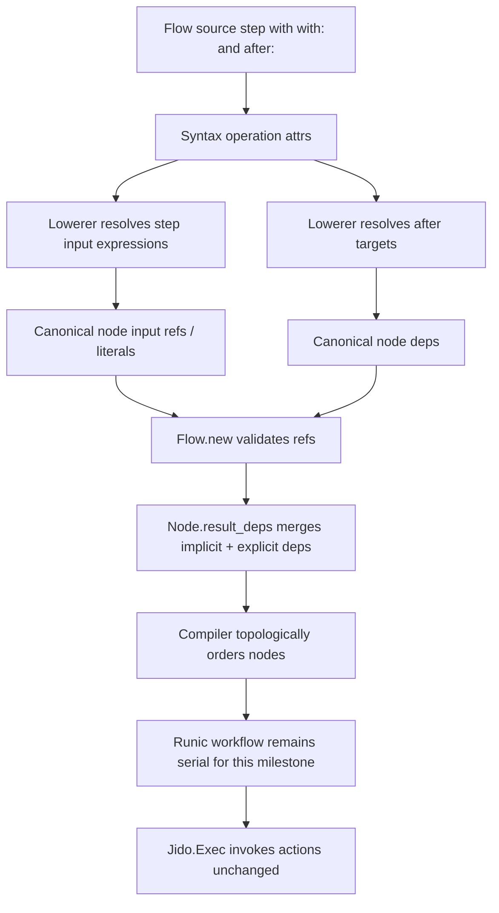

# feat: Add Explicit Flow graph edges

## Summary

Add a small `after:` syntax option for non-data dependency edges in `Jido.Flow`.
The feature lets authors express graph ordering without inventing fake input data, while preserving the current v4 boundary: `Jido.Flow` models inspectable IR and action composability, and `Jido.Exec` remains the exclusive invocation normalization boundary.

Source order remains declaration order and deterministic tie-break order. It is not a dependency edge.

---

## Problem Frame

The binding-first and projection-only slices made Flow source read like a small action-plan script. The remaining gap is graph intent that is not also data flow.

Today, a step can depend on another step by consuming its result:

```elixir
quote = step :quote, QuoteCart, with: cart
audit = step :audit_quote, AuditQuote, with: shape(%{quote_id: select(quote, :id)})
```

That works for data dependencies. It pushes authors toward fake data wiring when the real need is only ordering:

```elixir
quote = step :quote, QuoteCart, with: cart
audit = step :audit_quote, AuditQuote, with: shape(%{event: "quoted"}), after: quote
```

This slice should expose the dependency edge already present in the canonical IR. It should not add parallel execution, graph scheduling policy, branching, joins, map, reduce, accumulate, or loops.

---

## Requirements

### Graph Semantics

- R1. Flow source order must remain declaration order and deterministic tie-break order, not a semantic dependency edge.
- R2. Data references must continue to create implicit dependencies through existing result-ref dependency derivation.
- R3. `after:` must create an explicit non-data dependency edge that merges with implicit data dependencies in canonical node deps.
- R4. A step with no result-ref input and no `after:` target must remain independent in the canonical IR.

### Authoring Surface

- R5. Direct syntax and builder APIs must accept explicit dependency targets through step options.
- R6. Macro DSL and text parser source must accept `after:` in step keyword options while preserving the existing `with:` input style.
- R7. Equivalent programs across direct syntax, builder, macro DSL, and text parser surfaces must lower to equal canonical Flow maps.

### Validation

- R8. `after:` targets must be prior step names or prior binding handles for this slice.
- R9. Unknown, future, self, non-identifier, computed, or expression-shaped dependency targets must fail during lowering or source parsing before runtime execution.
- R10. Duplicate explicit edges and edges already implied by data refs must normalize to a stable unique dependency list.

### Boundaries

- R11. `after:` must lower to existing canonical `Node.deps`; no author-only edge expression should survive in the semantic map.
- R12. The compiler may continue serializing the topologically ordered graph into Runic for this milestone.
- R13. This feature must not change action invocation normalization, action return-shape handling, or `Jido.Exec.invoke_action/3`.

---

## Scope Boundaries

In scope:

- `after:` as the source-level spelling for explicit non-data dependencies.
- Dependency targets as prior binding handles or prior step-name atoms.
- Single target and list-of-target forms.
- Source `after:` in the existing keyword-option form with `with:`.
- Canonical dependency merging through existing node deps.
- Parser and macro allowlist expansion for only the new step option.
- Cross-surface parity tests and compiler ordering regression tests.

### Deferred to Follow-Up Work

- Forward references to later declarations.
- A graph-first lowerer that collects all nodes before validating refs.
- `before:` syntax or a `depends_on:` alias.
- A trailing fourth-argument source form such as `step :audit, Audit, input, after: quote`.
- Edge labels, edge provenance, or graph visualization.
- Graph-shaped Runic construction that preserves independent branches for concurrent execution.
- Static branch grouping, joins, map, reduce, accumulate, and loops.
- ReAct agent loops, LLM/tool policy, memory, retries, checkpoints, approvals, or telemetry semantics.

### Outside This Product's Identity

- Implicit line-by-line dependency semantics.
- Arbitrary Elixir evaluation inside Flow source.
- Moving action invocation normalization from `Jido.Exec` into `Jido.Flow`.
- Reintroducing legacy composition/runtime compatibility shims.

---

## Key Technical Decisions

- KTD1. Source spelling is `after:`: this reads naturally in the script spine and maps directly to canonical deps without exposing the internal `deps` name as authoring vocabulary.
- KTD2. Source order is not semantic: independent declarations keep empty deps, and the current serial compiler behavior remains only a deterministic tie-break for nodes with no ordering relationship.
- KTD3. Targets are prior-only for this slice: this matches the current binding-first validation model and avoids a graph-first lowerer rewrite until forward references are designed deliberately.
- KTD4. Binding handles and step atoms are edge identifiers, not data expressions: `after: quote` resolves the binding to its step name, while `after: :quote_step` names the step directly.
- KTD5. Canonical IR stays unchanged: the lowerer passes explicit deps into `Node.new/1`, and `Flow.new/1` continues to normalize explicit deps together with result-ref deps.
- KTD6. Runtime behavior stays conservative: compiler topological ordering should honor explicit deps, but this plan does not promise parallel execution or change `Jido.Exec` invocation behavior.

---

## High-Level Technical Design



The intended authoring model is:

```elixir
cart = step :load_cart, LoadCart, with: input(:cart_id)
quote = step :price_cart, PriceCart, with: cart
audit = step :audit_quote, AuditQuote, with: shape(%{event: "quoted"}), after: quote
return quote
```

`audit_quote` depends on `price_cart` because of the explicit edge, not because it consumes `quote` data. If `after:` is omitted and the input contains no result refs, the node is independent in the semantic graph.

---

## Acceptance Examples

- AE1. Given two adjacent steps with no result refs and no `after:`, when the flow lowers, then both nodes have empty deps.
- AE2. Given a step whose input references a prior binding, when the flow lowers, then the consumer depends on the producer through the existing implicit data dependency path.
- AE3. Given a step with `after: prior_binding` and no input result refs, when the flow lowers, then the step depends on the bound producer without adding data to its input.
- AE4. Given a step with both `after: prior_binding` and an input ref to the same producer, when the flow lowers, then the dependency appears once.
- AE5. Given `after:` points at an unknown, future, or self target, when the flow lowers or parses, then the error identifies the dependency target and the step being lowered.

---

## Implementation Units

### U1. Add direct syntax and builder edge affordances

**Goal:** Let programmatic authoring surfaces carry `after:` targets into the shared syntax layer without performing semantic normalization there.

**Requirements:** R5, R10, R11

**Dependencies:** None

**Files:**

- `lib/jido_flow/syntax.ex`
- `lib/jido_flow/builder.ex`
- `test/jido_flow/syntax_test.exs`
- `test/jido_flow/builder_test.exs`

**Approach:** Extend `Syntax.step/5` to preserve an optional `:after` option in operation attrs. Keep this layer structural: atoms, binding expressions, and lists should be carried for the lowerer to validate. Mirror the option through `Builder.step/5` by delegation.

**Execution note:** Start with focused failing syntax and builder tests before changing the constructors.

**Patterns to follow:** Existing `:bind` option handling in `Jido.Flow.Syntax.step/5` and builder delegation in `Jido.Flow.Builder`.

**Test scenarios:**

- Constructing a step with `after: :load_cart` stores the target in syntax operation attrs.
- Constructing a step with `after: Syntax.binding(:quote)` stores the binding target without lowering it.
- Constructing a step with multiple `after:` targets preserves the list for lowerer validation.
- Builder `step(..., after: ...)` produces the same syntax operation shape as direct syntax.
- Existing `bind:` behavior is unchanged when `after:` is absent.

**Verification:** Programmatic surfaces can express explicit edges, and existing syntax/builder tests continue to pass.

### U2. Lower explicit edges into canonical deps

**Goal:** Resolve explicit edge targets to canonical step names and merge them with existing result-ref dependencies.

**Requirements:** R1, R2, R3, R4, R8, R9, R10, R11

**Dependencies:** U1

**Files:**

- `lib/jido_flow/syntax/lowerer.ex`
- `test/jido_flow/syntax/lowerer_test.exs`
- `test/jido_flow/flow_test.exs`
- `test/jido_flow/node_test.exs`

**Approach:** Add lowerer support for a step `:after` attr. Resolve prior binding handles through the existing binding table and prior step atoms through the seen-step set. Pass the normalized step-name list to `Node.new/1` as `deps`, relying on existing node and flow normalization to sort, dedupe, and merge explicit deps with result refs.

**Execution note:** Add validation tests before implementation, especially the negative cases that distinguish unknown, future, and self dependencies.

**Patterns to follow:** Existing binding namespace validation, result-before-bound errors, and `Node.result_deps/1`.

**Test scenarios:**

- `after: :load_cart` on a later step lowers to `deps: [:load_cart]`.
- `after: Syntax.binding(:quote)` lowers to the bound producer node name and does not leak the binding alias into `Flow.to_map/1`.
- `after: [Syntax.binding(:quote), :reserve_inventory]` lowers to both canonical step names.
- A step with no result refs and no `after:` has empty deps even when it follows another step in source order.
- A step with both data input from `quote` and `after: quote` has one dependency on the producer.
- A future step-name target is rejected rather than introducing forward-reference semantics.
- A future binding target is rejected through the existing before-bound binding path.
- A self step-name target and a self binding target fail with source-aware details.
- Non-identifier edge targets such as maps, values, `select(...)`, `shape(...)`, or arbitrary expression structs are rejected.

**Verification:** Lowered canonical maps expose only real deps, and dependency validation fails before compiler execution.

### U3. Extend macro DSL and parser step options

**Goal:** Add source-level `after:` support while keeping the parser fail-closed and the `with:` input style intact.

**Requirements:** R6, R7, R8, R9

**Dependencies:** U1, U2

**Files:**

- `lib/jido_flow/dsl.ex`
- `test/jido_flow/dsl_test.exs`
- `test/jido_flow/parser_test.exs`

**Approach:** Replace the current exact `[with: input]` step-option match with an allowlisted step-option parser that accepts required `with:` and optional `after:` in keyword-option source. Raw third-argument step inputs remain valid when no keyword options are present, but combining raw input with a trailing fourth-argument `after:` form stays out of scope. Parse `after:` targets as bare binding handles, atom step names, or lists of those forms. Keep unsupported options and expression-shaped targets rejected at parse time where possible, and let the lowerer handle semantic target validation.

**Execution note:** Keep parser and macro tests paired so a change to quoted-source parsing cannot drift from compile-time DSL behavior.

**Patterns to follow:** Existing source allowlist handling in `Jido.Flow.DSL.parse_expression/2`, parser error wrapping in `Jido.Flow.Parser`, and rejection tests for unsupported step options.

**Test scenarios:**

- Macro DSL accepts `step :audit, Audit, with: shape(%{event: "quoted"}), after: quote`.
- Macro DSL accepts `after: [:load_cart, quote]` when both targets are prior dependencies.
- Text parser accepts the same forms and lowers to the same canonical map as macro DSL.
- `with:` and `after:` option order does not change the lowered result.
- Missing `with:` remains rejected rather than implying an empty input.
- Raw third-argument input without `after:` remains accepted for existing source compatibility.
- Raw third-argument input plus trailing `after:` remains rejected as unsupported step options.
- Unsupported option keys remain rejected.
- Duplicate `with:` or duplicate `after:` keys are rejected rather than silently picking one.
- `after: select(quote, :id)`, `after: shape(%{})`, remote calls, captures, arithmetic, and dot access remain rejected.

**Verification:** Source authoring surfaces support explicit edges without widening the Flow DSL into arbitrary Elixir evaluation.

### U4. Prove parity, ordering, and runtime boundary behavior

**Goal:** Add integration coverage showing explicit edges are semantic graph deps across all authoring surfaces while runtime invocation behavior stays delegated to `Jido.Exec`.

**Requirements:** R1, R2, R3, R4, R7, R12, R13

**Dependencies:** U1, U2, U3

**Files:**

- `test/support/flow_fixtures.ex`
- `test/integration/flow_parity_test.exs`
- `test/jido_flow/compiler_test.exs`
- `test/jido_exec/exec_test.exs`

**Approach:** Add one explicit-edge fixture expressed through direct syntax, builder, macro DSL, and parser source. The fixture should include an explicit non-data edge and an independent adjacent step so parity tests prove both sides of the source-order rule. Compiler tests should assert canonical explicit deps influence topological ordering, including a canonical node list that needs reordering because of `Node.deps`.

**Execution note:** Establish the current full-suite and coverage baseline before implementation, then keep the parity fixture as the final integration check.

**Patterns to follow:** Existing math, binding, and projection fixtures in `JidoTest.FlowFixtures`; existing parity tests in `test/integration/flow_parity_test.exs`; existing compiler dependency-order tests.

**Test scenarios:**

- Direct syntax, builder, macro DSL, and parser explicit-edge fixtures produce equal canonical maps.
- The canonical map contains an explicit dependency only on nodes named by data refs or `after:`.
- Adjacent independent fixture nodes do not acquire deps from declaration order.
- Compiler ordering honors explicit canonical `Node.deps` even when the node list is not already dependency ordered.
- Executing equivalent explicit-edge flows returns the same value across macro, builder, and parser surfaces.
- Existing `Jido.Exec` normalization tests remain the source of truth for action return shapes and errors; Flow tests assert only graph-local wrapping where relevant.

**Verification:** Cross-surface parity holds, compiler ordering uses the graph, and no new invocation behavior is introduced in Flow.

---

## Verification Plan

Implementation should follow the repository's TDD posture:

1. Capture the current full-suite and coverage baseline before changing behavior.
2. Add focused failing tests for each unit before implementation.
3. Keep syntax, lowerer, parser, parity, and compiler coverage meaningful for the touched modules.
4. Run focused test files around each changed surface as the unit lands.
5. Run the broader suite and coverage check after parity and compiler behavior are complete.

No new production dependencies are expected.

---

## Acceptance Criteria

- Authors can use `after:` across direct syntax, builder, macro DSL, and text parser surfaces.
- `after:` creates canonical node deps without modifying action input data.
- Data refs still create implicit deps.
- Source order alone does not create canonical deps.
- Duplicate explicit and implicit deps normalize to one stable dependency entry.
- Unknown, future, self, computed, and expression-shaped edge targets fail before runtime execution.
- Equivalent explicit-edge flows produce equal canonical maps across authoring surfaces.
- Compiler ordering respects explicit canonical deps while preserving current serial Runic construction.
- `Jido.Flow` does not take over invocation normalization from `Jido.Exec`.

---

## System-Wide Impact

This feature affects the public Flow authoring language and canonical graph semantics. The main downstream impact is positive: future static parallelism, joins, and loop planning can distinguish real graph ordering from incidental source adjacency.

The current executor behavior remains intentionally conservative. Independent nodes may still execute in declaration order today, but the IR must not claim that order as a dependency.

---

## Risks

### RSK1. Source order accidentally becomes semantic

It is tempting to treat script order as dependency order once `after:` exists. Guard against that with canonical-map tests where adjacent independent steps keep empty deps.

### RSK2. `after:` implies parallel execution too early

Explicit edges make graph intent visible, but this plan does not add graph-shaped Runic construction. Keep runtime claims limited to topological ordering and current deterministic serial execution.

### RSK3. Forward references sneak in through atom targets

Forward references require a different lowerer shape. Reject future targets for now and defer graph-first collection to a later plan.

### RSK4. Edge targets become expressions

Allowing `after:` to accept `result(...)`, `select(...)`, or computed values would blur data dependencies and control dependencies. Keep targets identifier-only.

### RSK5. Cross-surface drift

The parser, macro DSL, builder, and direct syntax can diverge subtly on keyword options. Add one explicit-edge fixture across all surfaces before broadening behavior.

---

## Sources & Research

Local context used:

- `JIDO_V4_BRIEF.md`
- `docs/ideation/2026-06-25-jido-flow-syntax-ideation.html`
- `docs/plans/2026-06-25-002-feat-binding-first-script-spine-plan.md`
- `docs/plans/2026-06-25-003-feat-projection-only-data-shaping-plan.md`
- `docs/solutions/architecture-patterns/flow-ir-exec-invocation-boundary.md`
- `lib/jido_flow/syntax.ex`
- `lib/jido_flow/builder.ex`
- `lib/jido_flow/dsl.ex`
- `lib/jido_flow/syntax/lowerer.ex`
- `lib/jido_flow/node.ex`
- `lib/jido_flow/compiler.ex`
- `test/support/flow_fixtures.ex`
- `test/integration/flow_parity_test.exs`
- `test/jido_flow/compiler_test.exs`

No external research was needed. The plan is grounded in the existing Flow IR, the local Runic compiler boundary, and the prior syntax slices.
