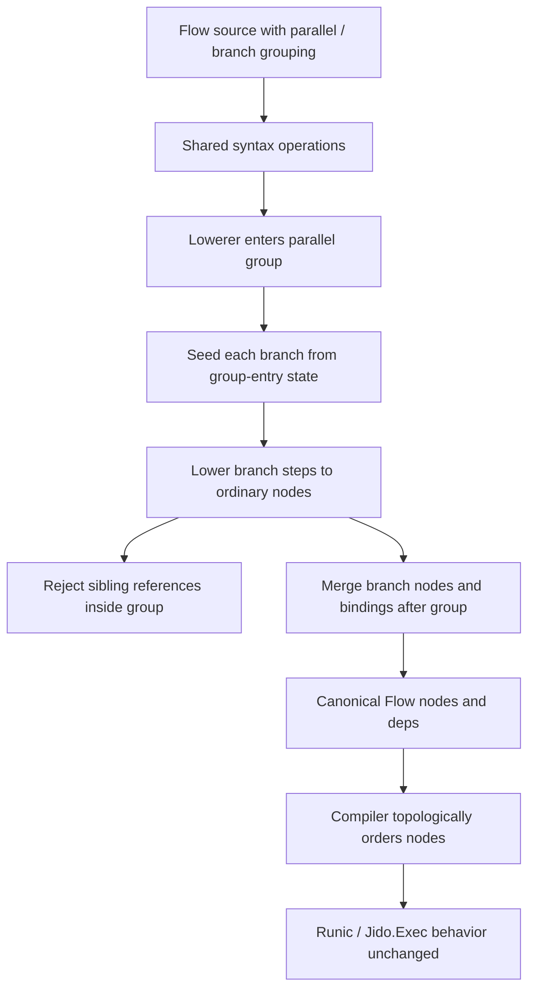

# feat: Add Honest Flow branch grouping

## Summary

Add a small `parallel` / `branch` authoring construct for static branch grouping in `Jido.Flow`.
The feature groups related branch steps for readability and provenance while lowering to ordinary canonical nodes and dependency edges.

---

## Problem Frame

Binding handles, projection-only shaping, and explicit `after:` edges now let Flow authors write readable action-composition scripts without fake data wiring.
The next language gap is visual structure: authors need to say "these independent lines of work are related branches" without pretending Flow has executable `if`, `case`, map, reduce, accumulate, or loop semantics.

The v4 brief names this as static parallelism: `parallel` groups independent branches for authoring clarity, but should not introduce a canonical entry type at first.
This plan keeps that promise by making branch grouping lower away into the existing IR.

---

## Requirements

### Authoring Shape

- R1. Flow source must support a `parallel` group containing named `branch` blocks.
- R2. Branch blocks must contain step operations only for this slice; branch-local `return`, nested `parallel`, and arbitrary DSL operations remain rejected.
- R3. Direct syntax and builder APIs must be able to construct the same grouped syntax shape as macro DSL and text parser source.
- R4. Equivalent grouped programs across direct syntax, builder, macro DSL, and text parser surfaces must lower to equal semantic Flow maps.

### Lowering Semantics

- R5. Branch grouping must lower to ordinary `%Jido.Flow.Node{}` values and existing node dependency edges.
- R6. Branch grouping must not create a canonical group node, synthetic join node, group result, implicit barrier, or implicit dependency between sibling branches.
- R7. A branch may reference values available before the group and values produced earlier in the same branch.
- R8. A step after the group may reference branch-produced step results or binding handles through the existing global result and binding model.
- R9. Source order must remain declaration order and deterministic tie-break order, not a semantic dependency edge.

### Validation

- R10. Branch names must be non-nil atoms and unique within a `parallel` group.
- R11. Step names and binding aliases must remain globally unique across grouped and ungrouped flow source.
- R12. Cross-branch references inside the same `parallel` group must be rejected so `parallel` does not hide an ordered dependency between sibling branches.
- R13. Unsupported branch targets, branch contents, option shapes, and parser AST forms must fail before runtime execution.

### Boundaries

- R14. Branch metadata may appear only as non-semantic provenance and only when provenance output is requested.
- R15. `Jido.Flow.Compiler` may continue serializing the topologically ordered graph into Runic for this milestone.
- R16. This feature must not change action invocation normalization, action return-shape handling, or `Jido.Exec.invoke_action/3`.
- R17. This feature must not add production dependencies.

---

## Scope Boundaries

In scope:

- `parallel do ... end` as a static grouping block.
- `branch :name do ... end` as a named branch block inside `parallel`.
- Named branch provenance on lowered nodes.
- Branch-aware lowerer validation that preserves sibling independence inside the group.
- Cross-surface parity across direct syntax, builder, macro DSL, and text parser source.
- Runtime regression tests proving grouped and flattened flows execute equivalently.

### Deferred to Follow-Up Work

- Conditional branch execution such as `choose`, `if`, `case`, or predicates.
- Branch-level return values, merged result shapes, joins, barriers, or fan-in helpers.
- Nested `parallel` groups.
- Anonymous branches.
- Branch-local namespaces.
- Graph-shaped Runic construction that preserves independent branches for concurrent execution.
- Map, reduce, accumulate, `each`, and loop semantics.
- ReAct agent loop semantics, tool policy, memory, retries, checkpoints, approvals, telemetry, or max-iteration behavior.

### Outside This Product's Identity

- Arbitrary Elixir evaluation inside Flow source.
- Implicit line-by-line dependency semantics.
- Moving action invocation normalization from `Jido.Exec` into `Jido.Flow`.
- Reintroducing legacy composition/runtime compatibility shims.

---

## Key Technical Decisions

- KTD1. `parallel` is structural, not executable control flow: it communicates branch grouping to authors and provenance, then lowers away into ordinary nodes.
- KTD2. Branches must be named: names give authors a stable debugging label without making the branch itself a canonical result.
- KTD3. Branch lowering uses group-entry state for each sibling: a branch can see pre-group bindings and its own earlier steps, but not sibling branch outputs inside the group.
- KTD4. Branch outputs become globally available after the group: individual step names and binding handles remain the addressable values, so there is no implicit group output.
- KTD5. No implicit join or barrier is added: authors must use `after:` or data references after the group when a later step truly depends on branch completion.
- KTD6. Provenance is node-local and non-semantic: branch labels can appear in `Flow.to_map(flow, provenance: true)`, while default semantic maps remain equal to equivalent flattened flows.
- KTD7. Parser changes stay allowlist-based: only `parallel` and `branch` block forms are added, and all other calls or branch expressions remain rejected.
- KTD8. Runtime and invocation boundaries stay unchanged: Runic compilation, topological ordering, and `Jido.Exec` invocation normalization are not broadened by this syntax feature.

---

## High-Level Technical Design



The intended source model is:

```elixir
cart = step :load_cart, LoadCart, with: input(:cart_id)

parallel do
  branch :pricing do
    priced = step :price_cart, PriceCart, with: cart
    step :audit_price, AuditPrice, with: shape(%{event: "priced"}), after: priced
  end

  branch :inventory do
    reserved = step :reserve_inventory, ReserveInventory, with: cart
  end
end

final = step :finalize, Finalize, with: shape(%{priced: priced, reserved: reserved})
return final
```

The `finalize` step is the explicit fan-in point because it references both branch outputs.
If a post-group step has no result refs and no `after:`, it remains independent even when it appears after the group in source.

---

## Acceptance Examples

- AE1. Given two sibling branches with independent steps, when the flow lowers, then the default semantic map is equivalent to a flattened flow with the same steps and dependencies.
- AE2. Given a branch step that consumes a pre-group binding, when the flow lowers, then the branch step depends on the pre-group producer through existing data dependency derivation.
- AE3. Given a branch step that consumes a prior binding in the same branch, when the flow lowers, then the branch-local dependency is accepted.
- AE4. Given a branch step that consumes a sibling branch binding inside the same `parallel` group, when the flow lowers, then validation fails before runtime.
- AE5. Given a post-group step that consumes outputs from two branches, when the flow lowers, then the post-group step depends on both branch producers.
- AE6. Given a post-group step with no result refs and no `after:`, when the flow lowers, then it has no deps despite appearing after the group.
- AE7. Given provenance output is requested, when a grouped flow is converted to a map, then branch nodes include their branch label as provenance.
- AE8. Given `return`, nested `parallel`, anonymous branch contents, or arbitrary calls appear inside a branch, when the macro DSL or parser sees them, then they are rejected.

---

## Implementation Units

### U1. Add branch-group syntax operations

**Goal:** Let programmatic surfaces represent `parallel` groups and named branches without lowering or validating their semantics.

**Requirements:** R1, R3, R10, R14

**Dependencies:** None

**Files:**

- `lib/jido_flow/syntax.ex`
- `lib/jido_flow/builder.ex`
- `test/jido_flow/syntax_test.exs`
- `test/jido_flow/builder_test.exs`

**Approach:** Add syntax constructors for a `parallel` operation whose attrs contain named branch operations or branch descriptors. Keep this layer structural: branch names and nested operation lists are preserved for the lowerer. Mirror the direct syntax affordance through builder helpers, following the existing builder delegation style.

**Execution note:** Start with focused failing syntax and builder tests before changing constructors.

**Patterns to follow:** Existing `Syntax.operation/3`, `Syntax.step/5`, `Syntax.return/2`, and builder delegation to syntax helpers.

**Test scenarios:**

- Constructing a named branch stores its name and ordered step operations.
- Constructing a parallel group stores multiple named branches without lowering them.
- Branch provenance can be supplied or defaulted without affecting semantic operation attrs.
- Builder helpers produce the same syntax operation shape as direct syntax helpers.
- Existing step, `after:`, `select`, and `shape` constructor behavior is unchanged.

**Verification:** Programmatic authoring surfaces can build grouped syntax, and no canonical Flow semantics are introduced in U1.

### U2. Lower branch groups honestly

**Goal:** Flatten branch groups into ordinary nodes while enforcing branch independence inside a group.

**Requirements:** R5, R6, R7, R8, R9, R10, R11, R12, R14

**Dependencies:** U1

**Files:**

- `lib/jido_flow/syntax/lowerer.ex`
- `test/jido_flow/syntax/lowerer_test.exs`
- `test/jido_flow/flow_test.exs`
- `test/jido_flow/node_test.exs`

**Approach:** Teach the lowerer to handle `:parallel` operations by lowering each branch from the same group-entry state plus that branch's own accumulated state. Merge nodes, seen step names, and binding aliases back into the outer state after all branches lower. Reuse existing node validation for duplicate names, binding collisions, result refs, and deps. Add branch provenance to nodes while keeping semantic maps unchanged by default.

**Execution note:** Implement validation test-first, especially sibling-reference and no-implicit-barrier cases.

**Patterns to follow:** Existing binding table handling, `all_steps` / `all_bindings` validation, explicit `after:` resolution, and provenance handling for source bindings.

**Test scenarios:**

- Two branches that each reference only pre-group input lower successfully with no deps between siblings.
- A branch step can reference a prior step in the same branch.
- A branch step can use `after:` against a prior step in the same branch.
- A branch step can use pre-group bindings and step names as normal dependencies.
- A branch step cannot reference a sibling branch binding declared earlier in source.
- A branch step cannot reference a sibling branch step by `after:`.
- A post-group step can reference branch outputs from multiple branches.
- A post-group step without refs or `after:` remains dependency-free.
- Duplicate branch names in one group fail with branch-aware details.
- Duplicate step names or binding aliases across branches fail through existing namespace validation.
- Lowering grouped and equivalent flattened syntax produces equal default semantic maps.
- Provenance-enabled maps include branch labels for grouped nodes only.

**Verification:** Branch grouping changes source structure and provenance only; canonical deps remain explicit through existing refs and `after:`.

### U3. Extend macro DSL and parser allowlists

**Goal:** Add source-level `parallel` and `branch` blocks while preserving fail-closed parser behavior.

**Requirements:** R1, R2, R4, R10, R13

**Dependencies:** U1, U2

**Files:**

- `lib/jido_flow/dsl.ex`
- `lib/jido_flow/parser.ex`
- `test/jido_flow/dsl_test.exs`
- `test/jido_flow/parser_test.exs`

**Approach:** Add explicit DSL parsing for a `parallel do ... end` operation that accepts only `branch :name do ... end` forms. Reuse the existing block-expression parser for branch bodies but restrict branch bodies to steps for this slice. Parser support continues to route through quoted Elixir AST and `Jido.Flow.DSL.__parse_block__/2`; no separate grammar or evaluation path is added.

**Execution note:** Keep macro DSL and text parser tests paired for every accepted and rejected source form.

**Patterns to follow:** Existing allowlisted parsing for `step`, `return`, `select`, `shape`, keyword step options, and parser wrapping of `CompileError` into validation errors.

**Test scenarios:**

- Macro DSL accepts a `parallel` block containing two named branches with steps.
- Text parser accepts the same source and lowers it to the same semantic map.
- Branch source can use bindings declared before the group.
- Branch source can bind step handles and use those handles after the group.
- Parser rejects `parallel :name` without a block.
- Parser rejects a branch without a name.
- Parser rejects branch names that are not literal atoms.
- Parser rejects `return` inside a branch.
- Parser rejects nested `parallel` inside a branch.
- Parser rejects arbitrary local calls, remote calls, aliases used as branch bodies, captures, pins, comprehensions, and unsupported assignments inside grouped source.

**Verification:** Source authoring exposes the same branch grouping model as direct syntax and builder without widening arbitrary Elixir evaluation.

### U4. Prove parity and runtime equivalence

**Goal:** Add fixtures and integration coverage showing branch grouping preserves authoring parity and runtime behavior.

**Requirements:** R4, R5, R6, R8, R15, R16

**Dependencies:** U1, U2, U3

**Files:**

- `test/support/flow_fixtures.ex`
- `test/integration/flow_parity_test.exs`
- `test/jido_flow/compiler_test.exs`

**Approach:** Add one branch-grouped fixture across direct syntax, builder, macro DSL, and text parser source. Add an equivalent flattened fixture for semantic map comparison. Runtime tests should execute grouped and flattened flows with the same inputs and assert equal returned values. Compiler tests should prove topological ordering honors explicit data and `after:` deps without deriving an implicit barrier from the grouping.

**Execution note:** Establish the current test and coverage baseline before implementation, then run focused parity/compiler tests before the broader suite.

**Patterns to follow:** Existing math, binding, projection, and explicit-edge fixtures in `FlowFixtures`, plus parity assertions in `test/integration/flow_parity_test.exs`.

**Test scenarios:**

- Direct syntax, builder, macro DSL, and text parser grouped flows produce equal semantic maps.
- Grouped and flattened fixtures produce equal semantic maps by default.
- Provenance-enabled grouped maps include branch labels while flattened maps do not.
- Executing grouped and flattened flows returns the same value for a fan-in step that consumes both branch outputs.
- A post-group independent side-effect step remains independent unless it has data refs or `after:`.
- Compiler ordering honors actual deps from branch outputs to the fan-in step.
- Compiler ordering does not add a synthetic join before unrelated post-group steps.

**Verification:** Branch grouping is proven as syntax and provenance parity, not new runtime scheduling behavior.

---

## System-Wide Impact

This is a public authoring-surface change for Flow macro DSL, parser source, builder, and direct syntax.
It does not change canonical Flow node shape, `Jido.Exec`, action contracts, dependency policy, or production dependencies.

---

## Risks & Dependencies

- Branch-aware lowering is more subtle than flattening source order. The implementation must lower siblings from group-entry state to avoid accidental cross-branch dependencies.
- Provenance-only grouping may feel underpowered if authors expect `parallel` to run concurrently. The plan names that boundary in requirements, acceptance examples, and tests.
- Macro AST scoping around variables assigned inside branch blocks needs focused tests because Flow source treats variables as symbolic binding handles, not runtime Elixir variables.
- Runic workflow construction remains serial in this milestone. This is acceptable because the feature promises structure, not parallel scheduling.
- Subagent research was not used because the available subagent tool requires explicit delegation authorization. Local repo research covered the relevant brief, implementation, tests, and institutional solution note.

---

## Sources & Research

- `JIDO_V4_BRIEF.md` defines Phase 3 static parallelism as branch grouping for authoring clarity that emits ordinary nodes and dependency edges.
- `docs/plans/2026-06-25-002-feat-binding-first-script-spine-plan.md` establishes binding handles, global binding validation, and parser allowlist posture.
- `docs/plans/2026-06-25-003-feat-projection-only-data-shaping-plan.md` establishes projection and shape as syntax that lowers away without a general expression evaluator.
- `docs/plans/2026-06-25-004-feat-explicit-graph-edges-plan.md` establishes source order as non-semantic and `after:` as explicit graph edges.
- `docs/solutions/architecture-patterns/flow-ir-exec-invocation-boundary.md` records the boundary that `Jido.Flow` models IR and action composability while `Jido.Exec` owns invocation normalization.
- `lib/jido_flow/syntax.ex`, `lib/jido_flow/syntax/lowerer.ex`, `lib/jido_flow/dsl.ex`, `lib/jido_flow/parser.ex`, and `lib/jido_flow/compiler.ex` show the existing operation, parser, lowerer, and Runic compilation patterns.
- No external research was needed; this plan is grounded in the local v4 brief, current Flow syntax architecture, and prior Flow syntax plans.
