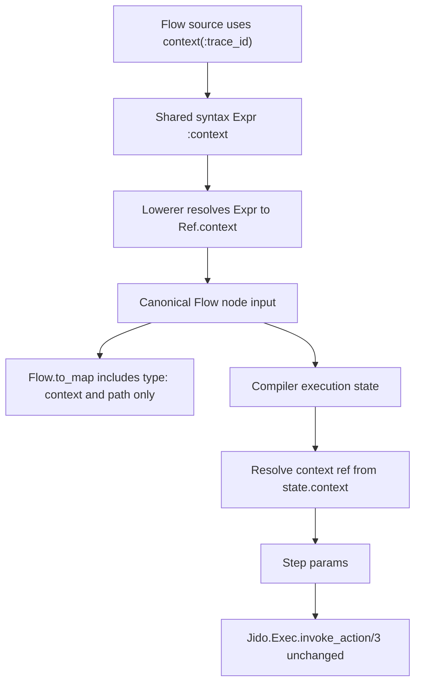

# feat: Add Flow-visible runtime context contract

## Summary

Add a small `context(...)` expression to `Jido.Flow` so authors can shape step input from runtime context values.
The feature makes context a first-class read-only Flow data source while preserving the existing boundary: `Jido.Flow` models the IR and action graph, and `Jido.Exec` remains the exclusive action invocation normalization boundary.

---

## Problem Frame

Flow execution already carries runtime context to action invocations, and the current compiler keeps that context outside canonical Flow maps.
That is correct for action invocation, but Flow authors cannot currently route a context value into a step's input payload without writing a custom action that copies it.

The next small language slice should expose context as data, not policy.
`context(:trace_id)` should behave like `input(:cart_id)` at the authoring and canonical-map layers, but it should resolve against runtime context during execution.
This keeps Flow useful for generated action plans, audit payload shaping, tenant/session propagation, and later agent-loop scaffolding without making Flow own mutable state, memory, or tool policy.

---

## Requirements

### Authoring Surface

- R1. Direct syntax must support `Syntax.context(path)` as a read-only expression source.
- R2. Builder APIs must mirror direct syntax with `Builder.context(path)`.
- R3. Macro DSL and text parser source must accept `context(path)` anywhere existing step input expressions accept `input(path)`.
- R4. `select(context(...), path)` and `shape(...)` must work with context expressions through the same projection-only data-shaping model as input and result refs.
- R5. Equivalent context-using programs across direct syntax, builder, macro DSL, and text parser surfaces must lower to equal canonical Flow maps.

### Canonical IR

- R6. `%Jido.Flow.Ref{}` must support a canonical `:context` source with normalized paths and deterministic `Flow.to_map/1` output.
- R7. Context refs must be valid node input expressions at root, nested map, and nested list positions.
- R8. Context refs must not create graph dependencies because runtime context is not produced by any Flow node.
- R9. Flow `return` must remain result-ref only for this slice; context values can be returned only by routing them through an action result.

### Runtime Semantics

- R10. `Jido.Flow.Compiler` must resolve context refs from the existing execution state context map.
- R11. Context path lookup should match input path lookup behavior, including atom-or-string map key lookup, list index lookup, missing-path `nil`, and root-path support.
- R12. Runtime context values must not be copied into the canonical Flow artifact, provenance, node deps, or semantic maps.
- R13. Adding context refs must not change action invocation normalization, action return-shape handling, action extras handling, or `Jido.Exec.invoke_action/3`.

### Validation

- R14. `context` must become a reserved binding alias so source bindings cannot shadow the expression helper.
- R15. Unsupported context expression forms, such as missing arguments, extra arguments, computed paths, keyword lists, remote calls, or arbitrary AST, must fail before runtime execution.
- R16. Existing unsupported-ref validation must remain fail-closed for unknown ref types.

### Boundaries

- R17. This feature must not introduce context mutation, context schemas, context validation, memory, session state, tool registries, approval policy, retries, checkpoints, or loop semantics.
- R18. This feature must not add production dependencies.

---

## Scope Boundaries

In scope:

- `context(path)` as a read-only Flow expression source.
- Canonical `%Jido.Flow.Ref{type: :context, path: ...}` values.
- Context projection through `select(...)`.
- Context refs inside `shape(...)`, maps, lists, and root step input.
- Runtime resolution from the existing Flow execution context map.
- Cross-surface parity and runtime equivalence tests.

### Deferred to Follow-Up Work

- Context schemas or validation separate from action input validation.
- Context writes, merges, mutation, or step-produced context values.
- Context-aware dependency edges or context availability constraints.
- Reserved namespaces for agent memory, tool registries, model policy, approval state, or telemetry.
- Secret redaction policy for context path names in canonical maps.
- Map, reduce, accumulate, `each`, and loop semantics.
- ReAct agent loop semantics, max iterations, tool-call observation state, memory, checkpoints, approvals, and telemetry.

### Outside This Product's Identity

- Arbitrary Elixir evaluation inside Flow source.
- Moving action invocation normalization from `Jido.Exec` into `Jido.Flow`.
- Treating runtime context as mutable Flow state.
- Reintroducing legacy composition/runtime compatibility shims.

---

## Key Technical Decisions

- KTD1. `context` is a canonical ref source: a context expression lowers to `%Jido.Flow.Ref{type: :context, path: ...}` so semantic maps remain deterministic and reviewable.
- KTD2. Context is read-only runtime data: Flow may resolve context values into step params, but it does not mutate context or define context policy.
- KTD3. Path behavior mirrors `input`: context refs use the same path normalization and runtime fetch behavior as input refs to avoid a second lookup contract.
- KTD4. `select` accepts context sources: projection-only shaping should treat input, result, and context refs as equally valid data sources.
- KTD5. Return stays result-only: preserving result-only returns avoids making Flow outputs depend directly on ambient runtime state without an action boundary.
- KTD6. Context refs add no deps: context is supplied to the whole execution, not produced by a node, so dependency derivation must ignore context refs.
- KTD7. Parser changes stay allowlist-based: `context(...)` joins the existing allowed expression forms and every unsupported form stays rejected before execution.
- KTD8. Exec remains the invocation boundary: compiler expression resolution may read context, but action invocation and return normalization stay in `Jido.Exec.invoke_action/3`.

---

## High-Level Technical Design



The intended authoring model is:

```elixir
audit =
  step :audit_request, AuditRequest,
    with:
      shape(%{
        user_id: input(:user_id),
        trace_id: context(:trace_id),
        tenant_id: select(context(:tenant), :id)
      })

return audit
```

The semantic map stores context references as refs, not runtime values:

```elixir
%{type: :context, path: [:trace_id]}
```

At execution time, the compiler resolves that ref from the context map it already carries for action invocation.

---

## Acceptance Examples

- AE1. Given direct syntax with `Syntax.context(:trace_id)`, when the syntax lowers, then the canonical node input contains `%{type: :context, path: [:trace_id]}`.
- AE2. Given `select(context(:tenant), :id)`, when the syntax lowers, then the canonical ref path is `[:tenant, :id]`.
- AE3. Given a context ref inside a step input, when the flow runs with `%{trace_id: "trace-1"}`, then the invoked action receives `"trace-1"` in its params.
- AE4. Given the same Flow runs with two different context maps, when `Flow.to_map/1` is called before and after execution, then the canonical map is unchanged.
- AE5. Given a missing context path, when the Flow executes, then the resolved value is `nil`, matching existing input path behavior.
- AE6. Given a node input contains only context refs and literals, when the Flow lowers and normalizes, then the node has no deps.
- AE7. Given source binds a step result to `context`, when the Flow lowers, then validation rejects the reserved binding alias.
- AE8. Given `return context(:trace_id)`, when the Flow lowers, then validation rejects it because return remains result-ref only.
- AE9. Given macro or parser source uses unsupported `context` forms, when source is parsed or compiled, then it fails before runtime execution.

---

## Implementation Units

### U1. Add the canonical context ref

**Goal:** Extend canonical Flow refs and node validation so context is an inspectable, deterministic IR source.

**Requirements:** R6, R7, R8, R9, R12, R16

**Dependencies:** None

**Files:**

- `lib/jido_flow/ref.ex`
- `lib/jido_flow/node.ex`
- `lib/jido_flow.ex`
- `test/jido_flow/ref_test.exs`
- `test/jido_flow/node_test.exs`
- `test/jido_flow/flow_test.exs`

**Approach:** Add `:context` to the canonical ref type enum, constructor, type spec, and `to_map/1`. Teach node input validation and map serialization to accept context refs wherever input and value refs are accepted. Ensure dependency collection ignores context refs, and keep Flow return validation result-only.

**Execution note:** Establish the current test and coverage baseline, then implement this unit test-first with focused ref and node tests.

**Patterns to follow:** Existing `Ref.input/1`, `Ref.to_map/1`, `Node.validate_input_expression/2`, `Node.result_deps/1`, and `Flow.validate_return/1`.

**Test scenarios:**

- Constructing `Ref.context(:trace_id)` normalizes to path `[:trace_id]`.
- Constructing `Ref.context(nil)` represents the root context path.
- `Ref.to_map(Ref.context([:tenant, "id", 0]))` emits `%{type: :context, path: [:tenant, "id", 0]}`.
- `Node.new/1` accepts context refs at root input, nested map leaves, and nested list leaves.
- `Node.to_map/1` serializes context refs without wrapping them as literal values.
- `Node.result_deps/1` and Flow dependency normalization ignore context refs and return only result dependencies plus explicit deps.
- `Flow.new/1` accepts nodes whose inputs contain context refs.
- `Flow.new/1` rejects `return: Ref.context(:trace_id)` with the existing return-ref validation path.
- Malformed unknown `%Ref{type: :unknown}` values remain rejected with invalid-ref details.

**Verification:** Canonical Flow artifacts can represent context refs without changing dependency semantics or return semantics.

### U2. Add context to shared syntax, builder, and lowerer

**Goal:** Let programmatic authoring surfaces build and lower context expressions through the same shared syntax pipeline as input, value, result, binding, select, and shape.

**Requirements:** R1, R2, R4, R5, R8, R14

**Dependencies:** U1

**Files:**

- `lib/jido_flow/syntax.ex`
- `lib/jido_flow/builder.ex`
- `lib/jido_flow/syntax/lowerer.ex`
- `test/jido_flow/syntax_test.exs`
- `test/jido_flow/builder_test.exs`
- `test/jido_flow/syntax/lowerer_test.exs`

**Approach:** Add a `:context` expression type and `Syntax.context/1`, then delegate it from `Builder.context/1`. Teach the lowerer to resolve context expressions to `Ref.context/1`. Expand `select` source validation to allow context refs, and add `:context` to reserved binding aliases.

**Execution note:** Add focused failing constructor and lowerer tests before modifying expression enums or lowerer validation.

**Patterns to follow:** Existing `Syntax.input/1`, `Builder.input/1`, `Lowerer.resolve_expr/3`, `Lowerer.validate_select_source/2`, and reserved binding validation.

**Test scenarios:**

- `Syntax.context(:trace_id)` creates a `%Syntax.Expr{type: :context, path: [:trace_id]}`.
- `Builder.context(:trace_id)` returns the same expression shape as direct syntax.
- A step input containing `Syntax.context(:trace_id)` lowers to `Ref.context(:trace_id)`.
- `Syntax.select(Syntax.context(:tenant), :id)` lowers to a context ref with path `[:tenant, :id]`.
- Context refs inside `Syntax.shape/1`, maps, and lists lower correctly.
- A context-only step input produces a node with empty deps.
- Binding a step as `bind: :context` fails as a reserved alias.
- Existing input, value, result, binding, shape, select, parallel, and branch behavior is unchanged.

**Verification:** Programmatic Flow authoring can express context refs, and context participates in existing projection-only data shaping without adding dependencies.

### U3. Extend macro DSL and text parser allowlists

**Goal:** Support `context(...)` in the source-level Flow language while preserving parser fail-closed behavior.

**Requirements:** R3, R4, R5, R14, R15

**Dependencies:** U1, U2

**Files:**

- `lib/jido_flow/dsl.ex`
- `lib/jido_flow/parser.ex`
- `test/jido_flow/dsl_test.exs`
- `test/jido_flow/parser_test.exs`

**Approach:** Add a parser branch for `context(path_ast)` in `Jido.Flow.DSL.parse_expression/2`, using the same path parsing rules as `input(path)`. Since `Jido.Flow.Parser` already delegates quoted source to the DSL parser, no separate parser grammar is needed beyond paired tests.

**Execution note:** Keep macro DSL and text parser tests paired for every accepted and rejected source form.

**Patterns to follow:** Existing parsing for `input`, `select`, `shape`, parser error wrapping in `Jido.Flow.Parser`, and rejection tests for unsupported expressions.

**Test scenarios:**

- Macro DSL accepts `context(:trace_id)` in `with:` and lowers to a context ref in the canonical map.
- Text parser accepts `context(:trace_id)` in equivalent source and lowers to the same canonical map.
- Macro DSL and text parser accept `select(context(:tenant), :id)`.
- Macro DSL and text parser accept context refs inside `shape(%{...})`.
- Macro DSL rejects `context()` and `context(:trace_id, :extra)` before runtime execution.
- Text parser rejects the same unsupported context arities with validation errors.
- Macro DSL and text parser reject computed context paths such as `context(System.system_time())`.
- Text parser continues rejecting arbitrary local calls and remote calls outside the Flow subset.

**Verification:** Source authoring surfaces support context refs without widening the Flow DSL into arbitrary Elixir evaluation.

### U4. Resolve context refs at runtime

**Goal:** Make compiler execution resolve context refs from the existing execution-state context map while leaving action invocation normalization untouched.

**Requirements:** R10, R11, R12, R13, R16

**Dependencies:** U1

**Files:**

- `lib/jido_flow/compiler.ex`
- `test/jido_flow/compiler_test.exs`

**Approach:** Add a compiler expression-resolution clause for `%Ref{type: :context}` that fetches from `state.context` using the existing `fetch_path/2` helper. Keep the existing context argument passed unchanged to `Exec.invoke_action/3`.

**Execution note:** Start with failing compiler tests that use canonical `Ref.context/1` values directly before relying on syntax or parser support.

**Patterns to follow:** Existing `%Ref{type: :input}` resolution, `fetch_path/2`, and the current context passthrough test using `ContextEcho`.

**Test scenarios:**

- A node input `%{trace_id: Ref.context(:trace_id)}` resolves from `%{trace_id: "trace-1"}`.
- Atom path lookup also reads string-keyed context maps, matching input behavior.
- Nested context map and list paths resolve through `fetch_path/2`.
- Missing context paths resolve to `nil`.
- `Ref.context(nil)` resolves to the full context map.
- Running the same Flow with two context maps changes step params but leaves `Flow.to_map/1` unchanged.
- An action still receives the original runtime context as its second argument when params also include context-derived values.
- Unsupported ref types still return a validation error from compiler expression resolution.
- Non-map context input remains rejected by the existing `Compiler.run/3` guard.

**Verification:** Runtime context is visible to Flow input shaping, but `Jido.Exec.invoke_action/3` and action return normalization are not modified.

### U5. Prove cross-surface parity and fixture coverage

**Goal:** Add a context fixture to the consolidated parity harness so future Flow syntax additions cannot drift across authoring surfaces.

**Requirements:** R5, R10, R11, R12, R13, R18

**Dependencies:** U1, U2, U3, U4

**Files:**

- `test/support/flow_fixtures.ex`
- `test/integration/flow_parity_test.exs`

**Approach:** Add a `context_flow` fixture family beside the existing math, binding, projection, explicit-edge, and branch-group fixtures. The fixture should combine input refs, context refs, context projection, and ordinary result return so it proves the contract without creating a special test-only path.

**Execution note:** Update the parity scenario table only after the focused unit tests pass, then use the parity test as the integration acceptance gate.

**Patterns to follow:** Existing fixture functions in `JidoTest.FlowFixtures`, scenario records in `test/integration/flow_parity_test.exs`, and the recently streamlined parity helpers.

**Test scenarios:**

- Direct syntax, builder, macro DSL, and text parser context flows produce equal canonical maps.
- The canonical context-flow map contains `type: :context` refs and no runtime context values.
- Executing each surface with `%{trace_id: "trace-1", tenant: %{id: "tenant-1"}}` returns the expected action result.
- Executing the same context flow with different context values returns different runtime results while the canonical map stays stable.
- The context fixture distinguishes `input(:trace_id)` from `context(:trace_id)` so input and context namespaces cannot be accidentally conflated.

**Verification:** Context becomes a supported Flow language feature only when all authoring surfaces, canonical maps, and execution behavior agree.

---

## System-Wide Impact

This plan changes the public Flow authoring language and canonical IR shape by adding a new ref type.
Downstream code that consumes `Flow.to_map/1` must tolerate `%{type: :context, path: ...}` in node inputs.

The change does not alter action contracts, `Jido.Instruction`, `Jido.Exec`, production dependencies, or Runic workflow construction.
It strengthens the path toward agent-oriented flows by making runtime metadata visible as data while keeping policy and state out of `Jido.Flow`.

---

## Risks & Dependencies

- **Canonical map consumers:** Any consumer assuming only `input`, `result`, and `value` ref types must update with this feature. Keep the canonical map change explicit in fixtures and tests.
- **Boundary drift:** It is tempting to add context validation or mutation once context is visible. Keep this slice read-only and leave schema/policy concerns deferred.
- **Secret path disclosure:** Canonical maps will show context path names, not values. Avoid naming or promising redaction behavior in this slice.
- **Parser widening:** `context(...)` should be one new allowlisted expression, not a reason to allow computed paths or arbitrary calls.
- **Test concentration:** Because this affects every authoring surface, parity coverage must remain the final gate, not a replacement for lower-level ref, lowerer, parser, and compiler tests.

---

## Deferred Implementation Notes

- Final error wording for unsupported context forms can reuse existing `unsupported flow DSL expression` paths unless implementation reveals a clearer existing error helper.
- If `select` source validation currently names only input/result in its message, update the message to include context while preserving existing test intent.
- Keep any fixture naming consistent with the consolidated parity harness discovered during implementation.

---

## Sources & Research

- `JIDO_V4_BRIEF.md` defines the IR-first, syntax-second Flow direction and says every authoring surface should lower into the same canonical Flow IR.
- `docs/plans/2026-06-25-001-feat-flow-exec-foundation-plan.md` records that runtime context is passed through execution without becoming part of the canonical Flow hash.
- `docs/solutions/architecture-patterns/flow-ir-exec-invocation-boundary.md` records the boundary that `Jido.Flow` models IR/action composability while `Jido.Exec` owns invocation normalization.
- `lib/jido_flow/ref.ex`, `lib/jido_flow/node.ex`, `lib/jido_flow/syntax.ex`, `lib/jido_flow/syntax/lowerer.ex`, `lib/jido_flow/dsl.ex`, and `lib/jido_flow/compiler.ex` show the current expression/ref/resolution path.
- `test/integration/flow_parity_test.exs` and `test/support/flow_fixtures.ex` show the cross-surface parity pattern this feature must extend.
- No external research was needed; the plan is grounded in the local v4 brief, current Flow architecture, and prior Flow syntax plans.
