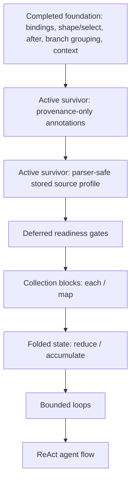
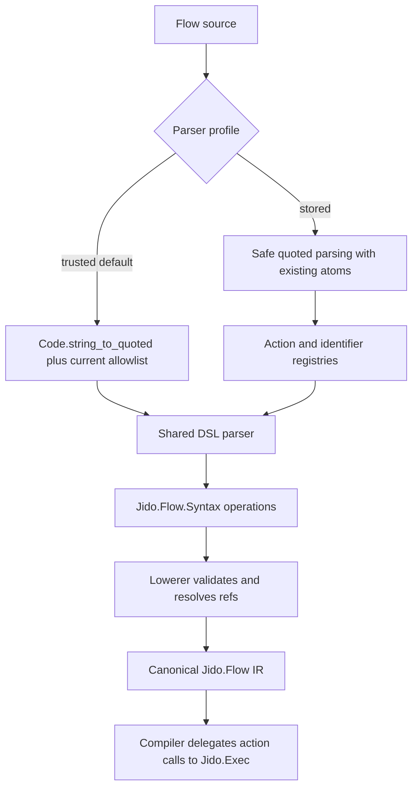

# feat: Plan remaining Flow syntax foundation

## Summary

Add the two remaining ranked Flow syntax foundation ideas: provenance-only plan annotations and a parser-safe stored source profile.
The plan also records the readiness gates for `each`, map, reduce, accumulate, loop, and ReAct flows, but keeps those dynamic control-flow concepts out of active implementation until their canonical semantics are clear.

---

## Problem Frame

The first five syntax ideas from the Flow ideation artifact are now represented in the plan trail and implementation: binding handles, projection-only shaping, explicit graph edges, honest branch grouping, and read-only runtime context refs.
That leaves two ranked survivors from the ideation document: annotations for inspectability, and a safe profile for stored or user-edited source.

The same ideation thread also raised the bigger destination: map/reduce/accumulate and loops for an LLM-agent ReAct flow.
The v4 brief explicitly warns that `choose`, `each`, and `loop` should not be introduced before their canonical IR and runtime semantics are clear.
This plan therefore completes the low-risk authoring foundation first, while making the deferred control-flow criteria visible enough to guide the next ideation cycle.

---

## Requirements

### Provenance-Only Annotations

- R1. Flow step authoring must support `label`, `tags`, and `note` annotations without changing default semantic maps.
- R2. Annotation metadata must appear only when provenance output is requested.
- R3. Annotation support must be available through direct syntax, builder APIs, macro DSL, and trusted text parser source.
- R4. Annotation values must be validated before lowering so provenance stays predictable for diagnostics and future visualization.
- R5. Source location provenance should include line and column metadata when the authoring surface can provide it.

### Stored Source Profile

- R6. The trusted developer parser must remain the default parser profile and keep existing behavior unless a stored profile is requested.
- R7. The stored source profile must parse source without creating arbitrary atoms from user text.
- R8. Stored source must resolve action identifiers through an explicit registry instead of accepting arbitrary module aliases.
- R9. Stored source identifier resolution must produce the same canonical `%Jido.Flow{}` shape as trusted source after identifiers are resolved.
- R10. Unknown action identifiers, unsupported identifier forms, unsafe atom literals, and unsupported AST forms must fail before runtime execution.

### Boundaries

- R11. Annotation and stored-source work must not change action invocation normalization, action return-shape handling, action extras handling, or `Jido.Exec.invoke_action/3`.
- R12. This plan must not add active syntax for `choose`, `each`, map, reduce, accumulate, loop, ReAct, retries, timeouts, scheduler policy, memory, approval, checkpoints, or telemetry policy.
- R13. This plan must not add production dependencies.

---

## Scope Boundaries

In scope:

- Step-level `label`, `tags`, and `note` annotations as provenance-only metadata.
- Best-effort source-span provenance from parser and macro DSL metadata.
- Cross-surface annotation parity across direct syntax, builder, macro DSL, and parser source.
- A stored parser profile that keeps trusted parsing as the default.
- Registry-based action resolution for stored source.
- Existing-atom or registry-resolved identifier handling that avoids user-driven atom creation.
- Safety and parity tests for stored-source parsing.

### Deferred to Follow-Up Work

- Flow-level and branch-level annotation expansion beyond the smallest useful slice.
- Standalone `note` statements that attach to a flow, branch, or following step.
- Canonical string identifiers for flow, node, branch, or binding names.
- A manifest-style non-Elixir source format.
- Graph-shaped Runic compilation for real concurrent independent branches.
- `choose`, `if`, `case`, predicates, branch return shapes, or conditional joins.
- `each`, map, reduce, accumulate, loop, and ReAct agent-loop syntax.
- Scheduler profiles, retries, timeouts, durability, checkpoints, memory, approval policy, or telemetry policy.

### Outside This Product's Identity

- Arbitrary Elixir evaluation inside Flow source.
- Treating annotations as execution semantics.
- Moving action invocation normalization from `Jido.Exec` into `Jido.Flow`.
- Reintroducing legacy composition/runtime compatibility shims.

---

## Key Technical Decisions

- KTD1. Annotations are provenance only: labels, tags, notes, and source spans help humans inspect flows but do not alter canonical semantic maps, dependencies, runtime execution, or return values.
- KTD2. Annotation values normalize to a small data contract: labels and notes are strings, tags are stable strings, and invalid shapes fail before lowering.
- KTD3. Source span is best-effort metadata: line and column data should be preserved when available, but semantic parity must not depend on exact source positions.
- KTD4. Stored source is a parser profile, not a replacement parser: `Jido.Flow.parse/2` keeps trusted developer parsing as the default while accepting an explicit stored-profile option.
- KTD5. Stored source resolves identifiers instead of creating them: action identifiers and non-local names pass through explicit registries or existing atoms, avoiding `String.to_atom/1`-style behavior.
- KTD6. Canonical names remain atoms for this slice: string-safe canonical identifiers are deferred because they would change the public IR and affect every existing authoring surface.
- KTD7. Runic capability does not imply Flow syntax: Runic supports map, reduce, accumulators, joins, context, scheduler policies, and runners, but Flow must define its own canonical semantics before exposing those concepts.
- KTD8. Exec remains the invocation boundary: Flow parser and compiler changes may resolve refs and metadata, but action invocation normalization stays in `Jido.Exec.invoke_action/3`.

---

## High-Level Technical Design





The intended annotation surface is small and step-local:

```elixir
quote =
  step :price_cart, PriceCart,
    with: cart,
    label: "Price cart",
    tags: ["pricing", "checkout"],
    note: "Business logic remains inside the action"

return quote
```

The intended stored-source profile keeps actions registry-based:

```elixir
flow do
  quote =
    step :price_cart, "price_cart",
      with: %{cart_id: input(:cart_id)}

  return quote
end
```

In the stored profile, `"price_cart"` resolves through parser options to an allowed action module.
The canonical Flow still contains an action module and atom step name after resolution.

---

## Control-Flow Readiness Matrix

| Concept | Required before syntax | Deferred risk |
|---|---|---|
| `each` / map | Collection source contract, per-item binding, result ordering, empty collection behavior, per-item failure behavior, and Runic fan-out compilation shape | Fake collection syntax could look deterministic while hiding concurrency and failure policy |
| reduce | Accumulator seed, reducer input shape, reducer action or subflow boundary, empty collection result, ordering guarantees, and final return shape | Reducer semantics can quietly become arbitrary expression evaluation |
| accumulate | Scope of state, init/reset behavior, mergeability, cross-run persistence, and whether state is Flow-local or Runner-owned | Mutable state in Flow can blur the IR/runtime boundary |
| loop | Loop state, max iterations, completion predicate, max-iteration return, error handling, telemetry/provenance, and cancellation behavior | Unbounded loops would make Flow own execution policy |
| ReAct | Thought/action/observation state shape, tool registry boundary, memory boundary, approval hooks, max steps, and final answer policy | Agent concerns can swallow Flow unless the loop is a bounded control node over actions |

---

## Implementation Units

### U1. Annotation Provenance Contract

**Goal:** Define the minimal annotation contract and lower annotations into existing non-semantic provenance.

**Requirements:** R1, R2, R4, R11, R13

**Dependencies:** None

**Files:**

- `lib/jido_flow/syntax.ex`
- `lib/jido_flow/syntax/lowerer.ex`
- `test/jido_flow/syntax_test.exs`
- `test/jido_flow/syntax/lowerer_test.exs`
- `test/jido_flow/flow_test.exs`

**Approach:** Extend step syntax options with normalized annotation fields. Merge annotation metadata into operation provenance before node construction, preserving existing binding and branch provenance behavior. Keep the default `Flow.to_map/1` output unchanged and expose annotations only through `Flow.to_map/2` with provenance enabled.

**Execution note:** Implement annotation behavior test-first, starting with semantic-map non-drift and provenance-map visibility.

**Patterns to follow:** Existing `provenance` handling in `Jido.Flow`, `Jido.Flow.Node`, and `Jido.Flow.Syntax.Lowerer`; existing `maybe_put_binding/2` and `maybe_put_branch/2` lowerer helpers.

**Test scenarios:**

- A step with `label`, `tags`, and `note` lowers successfully and stores normalized values in node provenance.
- `Flow.to_map/1` for an annotated flow is equal to the unannotated semantic map.
- `Flow.to_map(flow, provenance: true)` includes annotation metadata on the annotated node.
- Existing binding and branch provenance remain present when annotations are also present.
- Invalid annotation values, such as non-string labels or non-list tags, fail before runtime execution.

**Verification:** Annotated direct syntax produces stable canonical maps, and provenance-enabled maps expose only the annotation metadata needed for inspection.

### U2. Annotation Authoring Parity

**Goal:** Expose the annotation contract across builder, macro DSL, trusted parser source, and parity fixtures.

**Requirements:** R1, R2, R3, R5, R11

**Dependencies:** U1

**Files:**

- `lib/jido_flow/builder.ex`
- `lib/jido_flow/dsl.ex`
- `lib/jido_flow/parser.ex`
- `test/jido_flow/builder_test.exs`
- `test/jido_flow/dsl_test.exs`
- `test/jido_flow/parser_test.exs`
- `test/support/flow_fixtures.ex`
- `test/integration/flow_parity_test.exs`

**Approach:** Add annotation keys to the trusted step option allowlist and parse only literal annotation values. Preserve source span metadata from parser and macro DSL where available. Add a fixture that proves direct syntax, builder, macro DSL, and trusted parser source produce equal semantic maps while exposing equivalent annotation provenance where exact source spans are not part of the equality check.

**Execution note:** Start from a parity fixture so each authoring surface is forced to converge on the same semantic artifact.

**Patterns to follow:** The consolidated `flow_cases/0` parity structure in `test/integration/flow_parity_test.exs` and existing parser-format stability cases.

**Test scenarios:**

- Builder-created annotated syntax and direct annotated syntax lower to equal semantic maps.
- Macro DSL accepts `label`, `tags`, and `note` in keyword step options.
- Trusted parser source accepts the same annotation keys and rejects computed annotation values.
- Parser formatting variations do not change the semantic map for annotated source.
- Provenance-enabled maps include annotation metadata without requiring exact line/column parity across all surfaces.

**Verification:** The annotation fixture passes through all supported authoring surfaces with equal default canonical maps.

### U3. Parser Profile Plumbing

**Goal:** Introduce explicit parser profiles while keeping trusted developer parsing as the default.

**Requirements:** R6, R7, R10, R11, R13

**Dependencies:** None

**Files:**

- `lib/jido_flow/parser.ex`
- `lib/jido_flow/dsl.ex`
- `test/jido_flow/parser_test.exs`

**Approach:** Separate parser options into Flow config and parser config. Add an internal profile context passed from `Jido.Flow.Parser` into `Jido.Flow.DSL` parsing, with trusted mode preserving current behavior. Stored mode should use safe quoted parsing options and reject unsupported profile values before lowering.

**Execution note:** Characterize current trusted parser behavior before adding the profile branch.

**Patterns to follow:** Current `Parser.config/1`, `DSL.__parse_block__/2`, and parser validation error shaping through `Jido.Action.Error`.

**Test scenarios:**

- Existing `Jido.Flow.parse/2` calls without a profile continue to parse trusted fixtures.
- Invalid profile option values return validation errors before lowering.
- Stored profile rejects a source atom that does not already exist, and the test confirms the atom was not created.
- Stored profile still rejects remote calls, captures, module attributes, comprehensions, imports, and nested module definitions.
- Parser errors continue to include source line metadata when available.

**Verification:** Parser profile selection is explicit, backwards-compatible, and fail-closed.

### U4. Stored Source Identifier and Action Resolution

**Goal:** Make stored source useful by resolving actions and identifiers through explicit allowlists.

**Requirements:** R7, R8, R9, R10, R11, R13

**Dependencies:** U2, U3

**Files:**

- `lib/jido_flow/parser.ex`
- `lib/jido_flow/dsl.ex`
- `test/jido_flow/parser_test.exs`
- `test/support/flow_fixtures.ex`
- `test/integration/flow_parity_test.exs`

**Approach:** In stored mode, accept action identifiers that resolve through a parser-supplied registry. Reject arbitrary module aliases in action position. Keep canonical atom step names for this slice by requiring existing atom identifiers or explicit registry resolution for graph-local identifiers. Add a stored-source fixture that resolves to the same canonical map as an equivalent trusted-source fixture.

**Execution note:** Add failing safety tests before adding successful stored-source parsing.

**Patterns to follow:** Existing parser action-module allowlist behavior, lowerer namespace validation, and fixture-level canonical parity.

**Test scenarios:**

- Stored source resolves a registered action identifier to its action module and executes through `Jido.Exec`.
- Stored source rejects an unregistered action identifier.
- Stored source rejects a direct module alias in action position when registry mode is active.
- Stored source with registry-resolved identifiers produces the same semantic map as equivalent trusted source.
- Stored source can use annotation metadata from U2 without creating semantic-map differences.

**Verification:** Stored source can express a small Flow safely enough for storage/editing while preserving the existing canonical IR.

---

## Acceptance Examples

- AE1. Given an annotated Flow step, when the flow is converted with `Flow.to_map/1`, then the output matches the unannotated semantic map.
- AE2. Given the same annotated Flow step, when the flow is converted with provenance enabled, then the node includes the label, tags, note, and available source span.
- AE3. Given equivalent annotated flows across direct syntax, builder, macro DSL, and trusted parser source, when each is converted with `Flow.to_map/1`, then all semantic maps are equal.
- AE4. Given stored source with a registered action identifier, when it is parsed in stored mode, then the resulting Flow contains the resolved action module and executes through `Jido.Exec`.
- AE5. Given stored source containing an unsafe new atom or unregistered action identifier, when it is parsed in stored mode, then parsing fails before lowering and no runtime execution occurs.

---

## System-Wide Impact

Annotations broaden the non-semantic provenance surface but should not affect execution, dependency derivation, canonical map equality, or action invocation.
Stored-source parsing adds a new public parser posture, so tests must make the default trusted profile and the stored profile behavior visibly distinct.

The main downstream effect is on future authoring and tooling: graph visualizers, diagnostics, and generated Flow editors get a stable metadata lane without making metadata part of the executable artifact.
The control-flow readiness matrix gives future map/reduce/loop planning a starting contract without committing the current implementation to those semantics.

---

## Risks & Dependencies

- **Semantic map drift:** Annotation values leaking into default maps would break parity. Mitigate with fixture-level equality tests against equivalent unannotated maps.
- **False parser safety:** A stored profile that still creates atoms or accepts module aliases would look safer than it is. Mitigate with atom-creation regression tests and registry-only action resolution.
- **Registry friction:** Requiring registry resolution for stored source is less ergonomic than free-form source, but it preserves the current atom-based canonical IR until string identifiers are designed.
- **Provenance sprawl:** Annotation fields can become a dumping ground. Mitigate with a small validated contract and defer standalone notes or branch/flow annotation expansion.
- **Control-flow pressure:** Runic already supports the primitives users want, but exposing Flow syntax before IR semantics are clear would create long-lived ambiguity.

---

## Deferred Implementation Notes

When the team returns to map/reduce/accumulate/loop/ReAct, start with a canonical IR decision rather than parser sugar.
The minimum next ideation should decide whether Flow gains a new collection/control node kind, whether collection blocks are compiled directly to Runic map/reduce components, and how a bounded loop reports state, result, exhaustion, errors, and provenance.

For ReAct specifically, model the loop as a bounded state transition over actions:
the planner/action/observer steps should be ordinary action nodes inside a loop contract, while tool registry, memory, approval, durable checkpoints, and scheduler policy remain outside Flow unless a later design intentionally moves them in.

---

## Sources & Research

- `docs/ideation/2026-06-25-jido-flow-syntax-ideation.html`
- `JIDO_V4_BRIEF.md`
- `docs/plans/2026-06-25-002-feat-binding-first-script-spine-plan.md`
- `docs/plans/2026-06-25-003-feat-projection-only-data-shaping-plan.md`
- `docs/plans/2026-06-25-004-feat-explicit-graph-edges-plan.md`
- `docs/plans/2026-06-25-005-feat-honest-branch-grouping-plan.md`
- `docs/plans/2026-06-25-006-feat-flow-runtime-context-contract-plan.md`
- `docs/solutions/architecture-patterns/flow-ir-exec-invocation-boundary.md`
- `lib/jido_flow/syntax.ex`
- `lib/jido_flow/dsl.ex`
- `lib/jido_flow/parser.ex`
- `lib/jido_flow/syntax/lowerer.ex`
- `lib/jido_flow/compiler.ex`
- `test/integration/flow_parity_test.exs`
- `deps/runic/README.md`
- `deps/runic/lib/runic.ex`
